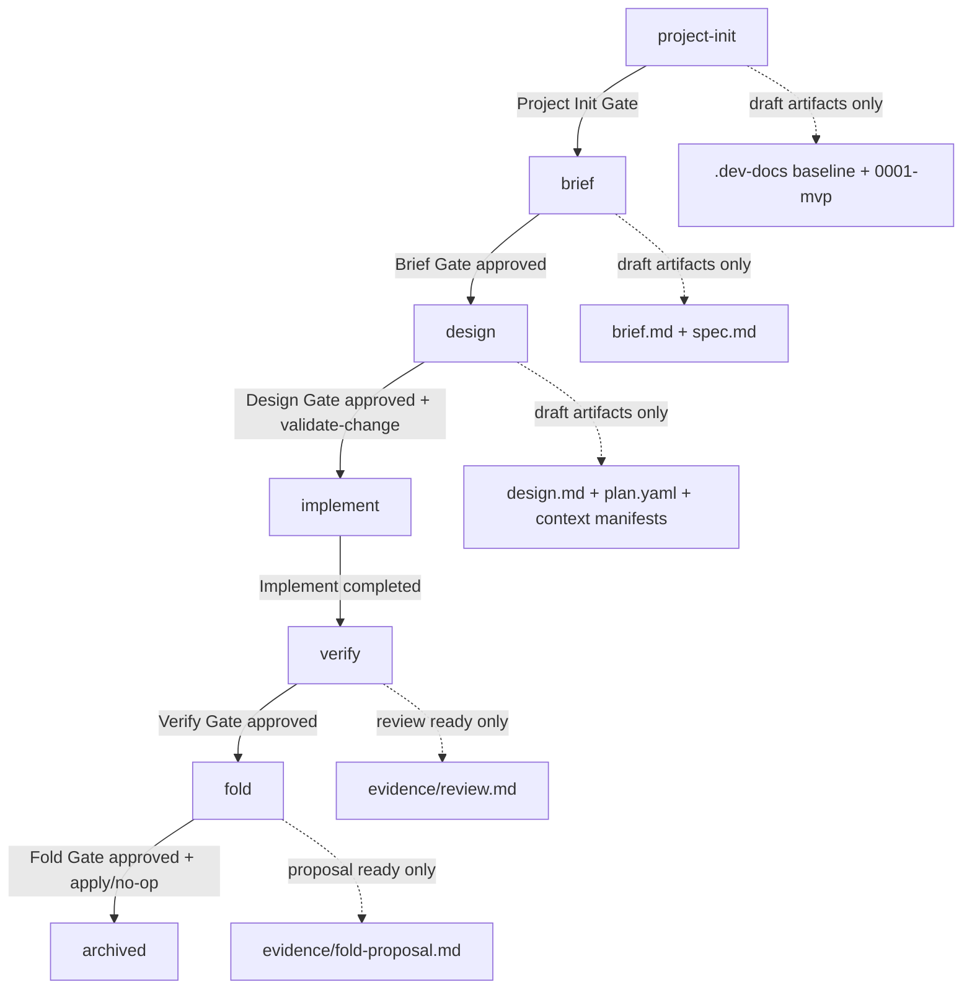
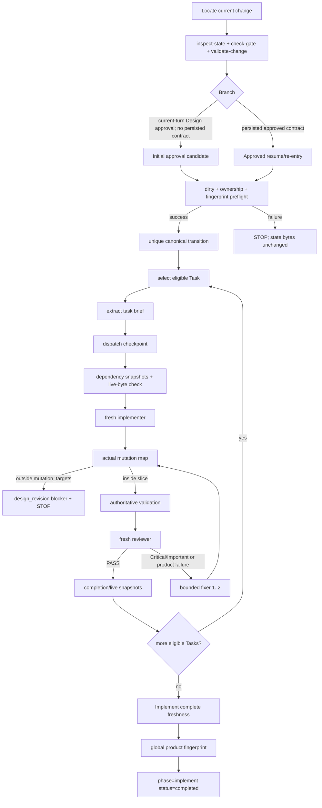

# Nuclio 当前实现基线分析

> 本文是 skill-forge Plan Task 1 的 Sequential 研究管线基线输出，供 Task 4 与 Trellis、Matt Pocock Skills 的实际实现分析进行统一比较。本文只描述当前仓库中的 Nuclio 实现，不提出或执行重构迁移。

## 1. 执行摘要

Nuclio 当前实现是一个以文件为事实源、以显式 Gate 为推进边界、以 bounded context 和 per-task SDD 编排为 mutation safety 核心的 Claude Code plugin。Marketplace 将 `nuclio` 注册为 `./plugins/nuclio-plugin`，并描述其为 file-backed lifecycle、lightweight task implementation、change-wide verification 与 approval-first knowledge folding 的 `/nuclio:*` 技能集合（`.claude-plugin/marketplace.json:19`、`.claude-plugin/marketplace.json:20`、`.claude-plugin/marketplace.json:21`）。插件 metadata 同样把六阶段写成个人 AI-coding harness 的入口能力（`plugins/nuclio-plugin/.claude-plugin/plugin.json:2`、`plugins/nuclio-plugin/.claude-plugin/plugin.json:3`）。根项目说明明确 Nuclio 提供 `/nuclio:project-init`、`/nuclio:brief`、`/nuclio:design`、`/nuclio:implement`、`/nuclio:verify`、`/nuclio:fold` 六个用户入口（`CLAUDE.md:27`、`CLAUDE.md:31`），并把当前生命周期固化为 `project-init → brief → design → implement → verify → fold`（`CLAUDE.md:97`）。

这个实现的强项是完整性：`.dev-docs/` 与 `state.json` 的事实源边界、artifact existence 不等于 Gate approval、Design 产出的 canonical task ownership、Implement 的 actual mutation hard boundary、Verify 的 change-wide review、Fold 的 proposal-first approval 都有明文协议与 helper/agent 边界支撑。复杂性的主要来源不是“六个阶段太多”，而是四类叠加：

1. **必要复杂性**：持久事实源、HITL Gate、ownership/handoff、snapshot/fingerprint freshness、Verify/Fold approval safety。
2. **可由脚本隐藏的复杂性**：`state-helper.py` 与 `task-helper.py` 已承担部分 deterministic validation，但 Protocol 中仍有大量 Controller 手工编排义务。
3. **重复协议**：SKILL、reference、agent prompt 多处重复同一 safety rule，降低 drift 风险的同时增加阅读和维护成本。
4. **应删除或重切的复杂性**：部分 prompt 级轨迹要求、无 tools/eval trajectory 分支、长篇 exact transition 文本可能超过用户实际交互所需，属于可在目标架构中压缩或分层的候选。

不可损坏的约束包括：文件事实源、artifact existence 不等于 Gate approval、当前轮明确 approval 才能批准 Gate、bounded context、`mutation_targets`/handoff ownership、actual mutation boundary、fresh reviewer、Verify change-wide freshness、Fold approval-before-apply，以及禁止把 `.nuclio/` runtime/cache/temp 边界替代 `.dev-docs/` source-of-truth。这些约束直接服务 mutation safety 与可审查知识沉淀，不能为了缩短流程而移除。

## 2. 当前实现盘点

### 2.1 用户入口 Skills

| 入口 | 文件 | 当前职责 | Gate / 停止点 | 权威边界 |
|---|---|---|---|---|
| `/nuclio:project-init` | `plugins/nuclio-plugin/skills/project-init/SKILL.md` | 初始化 `.dev-docs/` baseline 与第一个 MVP change；写最小 baseline 文件、`0001-mvp` change、canonical initial `state.json`、context manifests。 | Project Init Gate；创建 baseline 后必须 STOP（`plugins/nuclio-plugin/skills/project-init/SKILL.md:17`、`plugins/nuclio-plugin/skills/project-init/SKILL.md:110`、`plugins/nuclio-plugin/skills/project-init/SKILL.md:113`）。 | `.dev-docs/` 是事实源；不写业务代码；`.nuclio/` 只作为 runtime/cache/temp 边界且 MVP 不创建 runtime（`plugins/nuclio-plugin/skills/project-init/SKILL.md:11`、`plugins/nuclio-plugin/skills/project-init/SKILL.md:12`、`plugins/nuclio-plugin/skills/project-init/SKILL.md:16`）。 |
| `/nuclio:brief` | `plugins/nuclio-plugin/skills/brief/SKILL.md` | 定位或创建 active change，最小加载 baseline，上限 5 个 Grill 问题，写 `brief.md` / `spec.md` 与 pending Gate state。 | Brief Gate；`brief.md`/`spec.md` 只表示 draft，不等于 approval（`plugins/nuclio-plugin/skills/brief/SKILL.md:167`、`plugins/nuclio-plugin/skills/brief/SKILL.md:169`、`plugins/nuclio-plugin/skills/brief/SKILL.md:181`）。 | active discovery 只来自 index、candidate `state.json` 或用户命名；排除 completed/archived/inactive change；不新增 runtime/status pointer（`plugins/nuclio-plugin/skills/brief/SKILL.md:21`、`plugins/nuclio-plugin/skills/brief/SKILL.md:22`、`plugins/nuclio-plugin/skills/brief/SKILL.md:23`）。 |
| `/nuclio:design` | `plugins/nuclio-plugin/skills/design/SKILL.md` | 将 approved Brief 转成 `design.md`、canonical `plan.yaml`、`context/implement.jsonl`、`context/verify.jsonl` 与 pending Design state；运行 `task-helper.py validate-change`。 | Design Gate；static validation pass 不等于 Gate approval（`plugins/nuclio-plugin/skills/design/SKILL.md:267`、`plugins/nuclio-plugin/skills/design/SKILL.md:269`、`plugins/nuclio-plugin/skills/design/SKILL.md:281`、`plugins/nuclio-plugin/skills/design/SKILL.md:290`）。 | 必须有 persisted/current-turn Brief approval 且先持久化；`files_hint` 只导航；ownership 只来自 `mutation_targets` 与 `ownership_handoffs`；禁止 provisional design entry（`plugins/nuclio-plugin/skills/design/SKILL.md:11`、`plugins/nuclio-plugin/skills/design/SKILL.md:20`、`plugins/nuclio-plugin/skills/design/SKILL.md:178`、`plugins/nuclio-plugin/skills/design/SKILL.md:180`）。 |
| `/nuclio:implement` | `plugins/nuclio-plugin/skills/implement/SKILL.md` | Native lightweight SDD Controller：定位 change、helper preflight、ownership/snapshot/fingerprint preflight、顺序 dispatch fresh implementer/reviewer/fixer、持久 evidence 与 state。 | Implement complete 后只建议 Verify；不做 Verify/Fold/commit/final review（`plugins/nuclio-plugin/skills/implement/SKILL.md:141`、`plugins/nuclio-plugin/skills/implement/SKILL.md:150`、`plugins/nuclio-plugin/skills/implement/SKILL.md:154`、`plugins/nuclio-plugin/skills/implement/SKILL.md:158`）。 | Controller 是 state、ownership、snapshot、evidence persistence authority；worker/reviewer 不能决定 Gate/Task completion/mutation 权限（`plugins/nuclio-plugin/skills/implement/SKILL.md:11`、`plugins/nuclio-plugin/skills/implement/SKILL.md:14`、`plugins/nuclio-plugin/skills/implement/SKILL.md:37`）。 |
| `/nuclio:verify` | `plugins/nuclio-plugin/skills/verify/SKILL.md` | Completed implementation 的 change-wide independent critic：核对 implementation range、spec acceptance、全部 completed Task acceptance、Task evidence、Git truth 与 validation commands，写 mandatory `evidence/review.md`。 | Verify Gate；review ready 后 `gates.verify=pending` 并 STOP，只有用户 explicit accept 才可 approval（`plugins/nuclio-plugin/skills/verify/SKILL.md:20`、`plugins/nuclio-plugin/skills/verify/SKILL.md:21`、`plugins/nuclio-plugin/skills/verify/SKILL.md:166`、`plugins/nuclio-plugin/skills/verify/SKILL.md:183`）。 | Verify scope 必须完整覆盖 implementation range、全部 completed Task acceptance 与 `spec.md` acceptance；不得只看 current task/current diff/HEAD（`plugins/nuclio-plugin/skills/verify/SKILL.md:12`、`plugins/nuclio-plugin/skills/verify/SKILL.md:13`、`plugins/nuclio-plugin/skills/verify/SKILL.md:79`）。 |
| `/nuclio:fold` | `plugins/nuclio-plugin/skills/fold/SKILL.md` | Verify approved 后，基于 stable inputs 生成 `evidence/fold-proposal.md`，等待 accept/edit/reject/defer/no-op，再 approval-first apply 到长期 `.dev-docs` knowledge 并 archive。 | Fold Gate 与 close；approval 前不得修改长期 knowledge，reject/defer 不 archive（`plugins/nuclio-plugin/skills/fold/SKILL.md:11`、`plugins/nuclio-plugin/skills/fold/SKILL.md:149`、`plugins/nuclio-plugin/skills/fold/SKILL.md:152`、`plugins/nuclio-plugin/skills/fold/SKILL.md:193`）。 | Fold 只在 persisted Verify approved 且 review snapshot fresh 时运行；proposal 使用外部 hash metadata，不自指 hash（`plugins/nuclio-plugin/skills/fold/SKILL.md:12`、`plugins/nuclio-plugin/skills/fold/SKILL.md:14`、`plugins/nuclio-plugin/skills/fold/SKILL.md:115`）。 |

### 2.2 共享 references

| Reference | 文件 | 职责 | 权威边界 |
|---|---|---|---|
| File Protocol | `plugins/nuclio-plugin/references/protocol.md` | 定义 `.dev-docs` layout、change artifacts、authority table、canonical ownership contract、snapshot lifecycle、state transitions、dirty worktree、helper boundary、archival。 | 明确“Nucl.io 的事实源是文件，不是对话”（`plugins/nuclio-plugin/references/protocol.md:25`、`plugins/nuclio-plugin/references/protocol.md:27`）；并声明它是 ownership、handoff lineage、snapshot freshness、dynamic mutation 与 Design revision transition 的唯一算法 authority（`plugins/nuclio-plugin/references/protocol.md:139`）。 |
| Context Manifest Protocol | `plugins/nuclio-plugin/references/context-manifest.md` | 定义 `implement.jsonl` / `verify.jsonl` JSONL shape、required fields、Task scope、worker loading、forbidden inputs、context budget。 | Manifest 控制 stable context 读取，不授权 mutation ownership/write allowlist（`plugins/nuclio-plugin/references/context-manifest.md:15`、`plugins/nuclio-plugin/references/context-manifest.md:17`）；禁止 full conversation/all-doc/all-source/raw logs（`plugins/nuclio-plugin/references/context-manifest.md:163`）。 |
| Lightweight SDD | `plugins/nuclio-plugin/references/lightweight-sdd.md` | 对 Implement 的 bounded per-task orchestration 做摘要：preflight、eligibility、worker/reviewer contracts、completion、stop conditions、dispatch templates。 | 只摘要，不复制易漂移算法；authority 仍是 protocol/context-manifest（`plugins/nuclio-plugin/references/lightweight-sdd.md:14`、`plugins/nuclio-plugin/references/lightweight-sdd.md:18`、`plugins/nuclio-plugin/references/lightweight-sdd.md:20`）。 |
| Grill Protocol | `plugins/nuclio-plugin/references/grill-protocol.md` | 定义 clarification 问题格式、一次一个问题、最多 5 个、推荐答案、stop conditions 与 artifact rule。 | Nuclio 内置 Grill，不依赖 `grill-me`（`plugins/nuclio-plugin/references/grill-protocol.md:13`）；confirmed answers 必须写入 artifact（`plugins/nuclio-plugin/references/grill-protocol.md:56`、`plugins/nuclio-plugin/references/grill-protocol.md:58`）。 |
| Roadmap | `plugins/nuclio-plugin/references/roadmap.md` | 记录 MVP 已实现能力、deferred capabilities 与后续扩展边界。 | 明确 helpers 是 deterministic protocol helpers 不是 runtime；deferred 包括 status/resume/hooks/runtime/MCP/RAG/context reporting（`plugins/nuclio-plugin/references/roadmap.md:11`、`plugins/nuclio-plugin/references/roadmap.md:19`、`plugins/nuclio-plugin/references/roadmap.md:34`、`plugins/nuclio-plugin/references/roadmap.md:57`）。 |

### 2.3 Bounded agents

| Agent | 文件 | 工具 | 职责 | 不能做什么 |
|---|---|---:|---|---|
| Implementer | `plugins/nuclio-plugin/agents/nuclio-implementer.md` | `Read, Edit, Write, Grep, Glob, Bash` | 实现一个 approved Task，写 bounded implementation evidence。 | 不是 Controller，不是 state/ownership/snapshot/fingerprint/Gate authority（`plugins/nuclio-plugin/agents/nuclio-implementer.md:9`）；只能修改 `approved_ownership_slice.mutation_targets`（`plugins/nuclio-plugin/agents/nuclio-implementer.md:45`）。 |
| Task reviewer | `plugins/nuclio-plugin/agents/nuclio-task-reviewer.md` | `Read, Grep, Glob, Bash` | Fresh read-only reviewer，判断 spec compliance、code quality、approved ownership/handoff。 | 不修改文件、不批准 Verify/Fold、不做 change-wide review（`plugins/nuclio-plugin/agents/nuclio-task-reviewer.md:9`、`plugins/nuclio-plugin/agents/nuclio-task-reviewer.md:37`）；不能补授新 path（`plugins/nuclio-plugin/agents/nuclio-task-reviewer.md:49`）。 |
| Fixer | `plugins/nuclio-plugin/agents/nuclio-fixer.md` | `Read, Edit, Write, Grep, Glob, Bash` | 修复一个 Task 内 confirmed Critical/Important 或 validation product failure。 | 只在同一 approved slice 内修复；不能改变 ownership、snapshot、state 或 Gate（`plugins/nuclio-plugin/agents/nuclio-fixer.md:9`、`plugins/nuclio-plugin/agents/nuclio-fixer.md:40`、`plugins/nuclio-plugin/agents/nuclio-fixer.md:57`）。 |

### 2.4 Deterministic helpers 与测试

| Helper / Test | 文件 | 当前能力 | 明确不做 |
|---|---|---|---|
| `state-helper.py` | `plugins/nuclio-plugin/scripts/state-helper.py` | `inspect-state`、`check-gate`、`merge-state`、`replace-object`、`validate-design-revision`、`approve-design-revision`；实现 recursive preserve/merge、Gate approval guard、Design revision preflight/approval validation。 | 不是 runtime/daemon/hook/MCP/background automation（`plugins/nuclio-plugin/scripts/state-helper.py:4`、`plugins/nuclio-plugin/scripts/state-helper.py:5`、`plugins/nuclio-plugin/scripts/state-helper.py:6`）。`merge-state` 中 approval patch 必须带 `--allow-approval`（`plugins/nuclio-plugin/scripts/state-helper.py:223`、`plugins/nuclio-plugin/scripts/state-helper.py:227`）。 |
| `task-helper.py` | `plugins/nuclio-plugin/scripts/task-helper.py` | 校验 Plan/context manifest 窄子集、派生 `ownership_table` 与 `task_contract`、按 Task scope 提取 task brief。 | 不执行 tasks、不读取 manifest target content、不 mutate state、不 approve gates（`plugins/nuclio-plugin/scripts/task-helper.py:2`、`plugins/nuclio-plugin/scripts/task-helper.py:4`、`plugins/nuclio-plugin/scripts/task-helper.py:5`）。 |
| `test_state_helper.py` | `plugins/nuclio-plugin/scripts/test_state_helper.py` | 覆盖 inspect summary、merge preserve、Gate approval guard、replace-object、Design revision preflight/approval、canonical blocker/snapshot validation。 | 测试 helper 行为，不代表产品 runtime。Gate approval guard 测试验证没有 `--allow-approval` 时 bytes 不变（`plugins/nuclio-plugin/scripts/test_state_helper.py:294`、`plugins/nuclio-plugin/scripts/test_state_helper.py:308`、`plugins/nuclio-plugin/scripts/test_state_helper.py:312`）。 |
| `test_task_helper.py` | `plugins/nuclio-plugin/scripts/test_task_helper.py` | 覆盖 valid/canonical plan、manifest extraction、ownership handoff、reverse Plan order、control-plane mutation target rejection、stable task contract。 | 验证 declaration shape 与 extraction，不读取 context target；例如 reverse Plan order handoff 被接受但 chain 由 topology/handoff 派生（`plugins/nuclio-plugin/scripts/test_task_helper.py:365`、`plugins/nuclio-plugin/scripts/test_task_helper.py:380`、`plugins/nuclio-plugin/scripts/test_task_helper.py:381`）。 |

## 3. 用户 lifecycle 与显式 Gate

显式 Gate 贯穿六阶段：

- Project Init 必须在 baseline 后 STOP，不能自动 Design/Implement（`plugins/nuclio-plugin/skills/project-init/SKILL.md:110`、`plugins/nuclio-plugin/skills/project-init/SKILL.md:113`）。
- Brief 写 artifact 后 STOP，下一步必须是用户 review 后 `/nuclio:design`（`plugins/nuclio-plugin/skills/brief/SKILL.md:171`、`plugins/nuclio-plugin/skills/brief/SKILL.md:176`）。
- Design readiness 依赖 persisted/current-turn Brief approval，而不是 `brief.md` / `spec.md` 存在（`plugins/nuclio-plugin/skills/design/SKILL.md:11`、`plugins/nuclio-plugin/skills/design/SKILL.md:40`）。
- Implement entry 依赖 Design approval 与 helper/dirty preflight；当前轮 initial approval candidate 不能因为 persisted approved contract 尚不存在而重复请求同一 approval（`plugins/nuclio-plugin/skills/implement/SKILL.md:12`、`plugins/nuclio-plugin/skills/implement/SKILL.md:52`）。
- Verify review ready 只写 pending Gate；`evidence/review.md` 存在不等于 accepted（`plugins/nuclio-plugin/skills/verify/SKILL.md:20`、`plugins/nuclio-plugin/skills/verify/SKILL.md:183`）。
- Fold proposal ready 只写 pending Gate；approval 前不得修改长期 knowledge（`plugins/nuclio-plugin/skills/fold/SKILL.md:11`、`plugins/nuclio-plugin/skills/fold/SKILL.md:149`）。

## 4. Implement 控制器视角

控制器视角的核心安全点：

1. **互斥 entry/resume 分支**：initial approval candidate 与 approved resume/re-entry 必须互斥，Phase 1/2 先只读或内存 reconcile，成功后才执行唯一 transition（`plugins/nuclio-plugin/skills/implement/SKILL.md:53`、`plugins/nuclio-plugin/skills/implement/SKILL.md:54`、`plugins/nuclio-plugin/skills/implement/SKILL.md:55`、`plugins/nuclio-plugin/skills/implement/SKILL.md:72`）。
2. **ownership handoff 不来自 Plan 顺序**：handoff chain 由 dependency topology + explicit edges 决定，Plan order 只用于 tie-break（`plugins/nuclio-plugin/skills/implement/SKILL.md:16`、`plugins/nuclio-plugin/references/protocol.md:147`）。
3. **snapshot/fingerprint authority 在 Controller**：Controller 生成并验证 completion/dependency/live snapshots，worker hash 只作 audit（`plugins/nuclio-plugin/skills/implement/SKILL.md:17`、`plugins/nuclio-plugin/references/protocol.md:159`）。
4. **actual mutation hard boundary**：authoritative validation/reviewer 之前，actual product mutation map 必须完全落在当前 Task approved `mutation_targets`；越界必须形成 `design_revision` blocker（`plugins/nuclio-plugin/skills/implement/SKILL.md:120`、`plugins/nuclio-plugin/skills/implement/SKILL.md:121`、`plugins/nuclio-plugin/skills/implement/SKILL.md:122`）。
5. **fresh reviewer 与 fixer budget**：每个 Task fresh implementer 后 fresh reviewer；Critical/Important 或 product failure 进入最多两轮 fixer/re-review（`plugins/nuclio-plugin/skills/implement/SKILL.md:18`、`plugins/nuclio-plugin/skills/implement/SKILL.md:128`、`plugins/nuclio-plugin/skills/implement/SKILL.md:129`）。
6. **Implement complete 不是 Verify**：Implement complete 只证明 per-path freshness 与 global product fingerprint；仍未做 change-wide review 或 Verify approval（`plugins/nuclio-plugin/skills/implement/SKILL.md:149`、`plugins/nuclio-plugin/skills/implement/SKILL.md:150`、`plugins/nuclio-plugin/skills/implement/SKILL.md:158`）。

## 5. 上下文工程清单

| 阶段 | 必读 | 按需读 | 禁止读 | Context manifest / worker input / reviewer input | 限制强度判断 |
|---|---|---|---|---|---|
| project-init | 当前项目 `.dev-docs/` 是否存在；Grill Protocol；File Protocol layout。 | 用户回答、项目最小 baseline 所需信息。 | 完整历史对话、整个代码库、business code mutation。 | 初始创建 `context/implement.jsonl`、`context/verify.jsonl`；无 worker/reviewer。 | **真实限制**：明文禁止全历史/全代码与业务代码（`plugins/nuclio-plugin/skills/project-init/SKILL.md:13`、`plugins/nuclio-plugin/skills/project-init/SKILL.md:14`、`plugins/nuclio-plugin/skills/project-init/SKILL.md:16`）。 |
| brief | `.dev-docs/index.md`、`.dev-docs/changes/index.md`、candidate `state.json`、protocol/grill/context references。 | 必要二级索引、可从 docs/code 推断的答案。 | 默认读完整 `.dev-docs`、每个 change、large artifacts。 | 创建/更新 change artifacts；未派 worker。 | **真实限制**：active selection 和 minimal context 有清晰规则（`plugins/nuclio-plugin/skills/brief/SKILL.md:12`、`plugins/nuclio-plugin/skills/brief/SKILL.md:82`、`plugins/nuclio-plugin/skills/brief/SKILL.md:86`）。 |
| design | current change `brief.md` / `spec.md`、`references/context-manifest.md`、helper commands。 | 与 spec 相关 architecture/engineering/domain 索引与源码探索。 | 默认读取全部源码、Chorus 式全量上下文。 | 生成 `context/implement.jsonl` 与 `context/verify.jsonl`；设计 Task scoped context。 | **真实限制 + 重复提示**：manifest shape 强，但“不要全量读取”在 Skill/reference 多处重复（`plugins/nuclio-plugin/skills/design/SKILL.md:76`、`plugins/nuclio-plugin/skills/design/SKILL.md:80`、`plugins/nuclio-plugin/skills/design/SKILL.md:202`）。 |
| implement | `state.json`、`plan.yaml`、两个 manifests、approved contract、Task brief、matching required context、incoming snapshots。 | matching `mode=jit` entries；Task-local source discovery from acceptance/files_hint/symbol/import/direct caller。 | full context、完整 Plan 给 worker、完整 ownership table、full history、parallel mutation。 | `task-helper.py extract-task` 写 fixed `task-brief.md`；implementer package 包含 approved ownership slice、incoming snapshots、allowed context；reviewer package 包含 actual mutation map/bounded diff。 | **最强真实限制**：helper extraction、agent input contract、ownership slice、actual mutation boundary 形成闭环（`plugins/nuclio-plugin/references/context-manifest.md:91`、`plugins/nuclio-plugin/references/context-manifest.md:108`、`plugins/nuclio-plugin/skills/implement/SKILL.md:109`、`plugins/nuclio-plugin/skills/implement/SKILL.md:116`）。 |
| verify | state readiness、Plan definitions、spec acceptance、Task evidence、verify manifest、Git truth。 | JIT verify context；exact validation commands。 | full history、all `.dev-docs`、all source、raw logs、reviewer transcript。 | `context/verify.jsonl` 必须合法且更聚焦；review artifact 绑定 base/head/fingerprints。 | **真实限制**：Verify manifest 与 readiness 都 fail closed；但需 Controller 手动核对多个证据源（`plugins/nuclio-plugin/skills/verify/SKILL.md:15`、`plugins/nuclio-plugin/skills/verify/SKILL.md:16`、`plugins/nuclio-plugin/skills/verify/SKILL.md:101`）。 |
| fold | current change stable artifacts、`evidence/review.md`、scoped product diff summary、相关长期 doc indexes。 | target long-term docs for duplicate/reconciliation。 | 完整历史、raw logs、session journals、全部 `.dev-docs`、全部 source。 | 只写 `evidence/fold-proposal.md` pre-approval；apply 后写长期 docs。 | **真实限制**：proposal-first 和 stable-only 明确；但用户交互分支多，提示成本高（`plugins/nuclio-plugin/skills/fold/SKILL.md:15`、`plugins/nuclio-plugin/skills/fold/SKILL.md:16`、`plugins/nuclio-plugin/skills/fold/SKILL.md:87`）。 |

结论：Nuclio 的 context 设计不是单纯“少读文件”的提示，而是通过 manifest shape、Task scoped extraction、agent input contract 和 forbidden inputs 形成多层约束。真正限制上下文的是 manifest validation/extraction 与 Task package；重复提示主要集中在“不要 full history / all source / runtime expansion / artifact existence is not approval”等安全语句，这些适合在目标架构中提炼为单一 authority + 短引用。

## 6. 中间产物账本

| 产物 | 位置/例子 | 类型 | Source-of-truth / mutable / derived / audit | 可删除候选判断 |
|---|---|---|---|---|
| Project baseline | `.dev-docs/index.md`、project/product/architecture/engineering/domain docs | 长期知识 | Source-of-truth。Protocol 定义 `.dev-docs/` 为项目知识与当前 change 事实源（`plugins/nuclio-plugin/references/protocol.md:39`）。 | 不可删除；可由 Fold 最小追加/编辑。 |
| Change artifacts | `.dev-docs/changes/<change-id>/brief.md`、`spec.md`、`design.md`、`plan.yaml`、`context/*` | 当前 change 控制面 | `plan.yaml` 定义 Task；`state.json` 保存 mutable state；artifact existence 不等于 Gate approval（`plugins/nuclio-plugin/references/protocol.md:119`、`plugins/nuclio-plugin/references/protocol.md:127`）。 | 不可删除；可在 future design 中合并 spec/brief 或重命名，但必须保留事实源语义。 |
| `state.json` | `.dev-docs/changes/<change-id>/state.json` | 可恢复状态机 | Mutable source-of-truth for phase/status/current_task/Gates/tasks（`plugins/nuclio-plugin/references/protocol.md:130`）。 | 不可删除；可脚本化隐藏复杂字段。 |
| `plan.yaml` | `.dev-docs/changes/<change-id>/plan.yaml` | Task contract declaration | Task definition/依赖/acceptance/verification/rollback authority，不保存执行进度（`plugins/nuclio-plugin/references/protocol.md:129`）。 | 不可删除；可考虑更结构化格式，但执行状态不得回写。 |
| Context manifests | `context/implement.jsonl`、`context/verify.jsonl` | Bounded context declaration | Stable context declaration，不是内容缓存，不授权 mutation（`plugins/nuclio-plugin/references/context-manifest.md:13`、`plugins/nuclio-plugin/references/context-manifest.md:17`）。 | 不可删除；可由 helper 生成/压缩。 |
| Task brief | `evidence/tasks/<task-id>/task-brief.md` | Worker handoff | Derived from Plan + manifest + ownership table；`extract-task` 只写指定 brief（`plugins/nuclio-plugin/scripts/task-helper.py:738`、`plugins/nuclio-plugin/scripts/task-helper.py:745`）。 | 可再生但当前用于 evidence binding；不能随意删除旧 cycle 相关 brief。 |
| Implementer/validation/review evidence | `evidence/tasks/<task-id>/implementer.md`、`validation.md`、`review.md` | Audit + completion evidence | Fixed four Markdown evidence files；append-only cycles，不覆盖旧证据（`plugins/nuclio-plugin/references/protocol.md:112`、`plugins/nuclio-plugin/references/protocol.md:114`、`plugins/nuclio-plugin/references/protocol.md:116`）。 | 不可删除；可以减少冗余文本模板，但保留 cycle identity。 |
| Snapshots | `evidence/tasks/<task-id>/snapshots/*.json` | Structured audit/freshness evidence | Controller-generated append-only per-path snapshot；not helper/runtime state（`plugins/nuclio-plugin/references/protocol.md:153`、`plugins/nuclio-plugin/references/protocol.md:155`、`plugins/nuclio-plugin/references/protocol.md:156`、`plugins/nuclio-plugin/references/protocol.md:157`）。 | 不可删除；可由 helper 管理生成以降低手工负担。 |
| Verify review | `evidence/review.md` | Change-wide critic artifact | Mandatory review verdict，ready metadata 绑定 external hash/fingerprints（`plugins/nuclio-plugin/skills/verify/SKILL.md:127`、`plugins/nuclio-plugin/skills/verify/SKILL.md:168`）。 | 不可删除；可格式精简。 |
| Fold proposal/apply | `evidence/fold-proposal.md`、`evidence/fold-apply.md`、`state.json.fold_apply` | Proposal/apply audit | Proposal-first artifact；approval 前不是长期知识；apply journal 证明 two-phase apply（`plugins/nuclio-plugin/references/protocol.md:132`、`plugins/nuclio-plugin/references/protocol.md:134`、`plugins/nuclio-plugin/skills/fold/SKILL.md:87`）。 | 不可删除；可用结构化 proposal 降低交互冗长。 |

## 7. 五维诊断与复杂性来源

> 本节按 Task 4 需要的统一比较维度固定 Nuclio 基线。五维为 `structural compliance`、`pattern fit`、`trigger accuracy`、`token efficiency`、`flow completeness`。

### 7.1 structural compliance

Nuclio 高度遵守 marketplace/plugin/skill 结构：根说明定义 marketplace → plugin metadata → skills hierarchy（`CLAUDE.md:19`、`CLAUDE.md:21`、`CLAUDE.md:22`、`CLAUDE.md:23`），Nuclio 采用 plugin-level `references/`、`agents/`、`scripts/`（`CLAUDE.md:41`、`CLAUDE.md:42`、`CLAUDE.md:43`）。六个 SKILL.md 均带 frontmatter，并使用 `disable-model-invocation: true` 表明这是 prompt/protocol layer，而不是自动模型 invocation。结构完整的代价是文件多、引用多、同步要求高。

### 7.2 pattern fit

Nuclio 当前模式是 Sequential + HITL + bounded per-task Generator-Critic。Brief/Design 采用 Grill clarification；Implement 采用 per-task implementer/reviewer/fixer；Verify 是 change-wide critic；Fold 是 proposal-first knowledge sink。这与“file-backed lifecycle + lightweight SDD”目标高度匹配。证据包括 Implement workflow 的 Coordinator routing + per-task Generator-Critic 描述（`plugins/nuclio-plugin/skills/implement/SKILL.md:35`、`plugins/nuclio-plugin/skills/implement/SKILL.md:37`）和 Verify 的 Generator-Critic style change-wide verification（`plugins/nuclio-plugin/skills/verify/SKILL.md:38`、`plugins/nuclio-plugin/skills/verify/SKILL.md:40`）。问题是 pattern 被写入多个层级，读者需要跨 Skill/reference/agent/helper 才能理解一个完整 transition。

### 7.3 trigger accuracy

每个 Skill 的 `description: Use when` 大体明确，但 Gate 触发条件非常严格：Design pending 时不能 provisional entry，Implement initial approval candidate 与 resume 要互斥，Verify 只在 state 精确 completed 时进入，Fold 只在 persisted Verify approved 且 freshness matching 时进入。Trigger accuracy 高，误触发风险低；但用户会感到“明明文件已经生成还要确认”的交互啰嗦，这是 artifact/Gate 分离带来的安全成本，而非阶段数量本身。

### 7.4 token efficiency

Token efficiency 是最弱维度。正向设计包括 context manifest、Task scoped entries、verify manifest smaller than implement manifest（`plugins/nuclio-plugin/references/context-manifest.md:63`、`plugins/nuclio-plugin/references/context-manifest.md:136`），以及 worker 禁止 full source/history（`plugins/nuclio-plugin/references/context-manifest.md:113`、`plugins/nuclio-plugin/references/context-manifest.md:163`）。负向成本是协议文本极长，Implement/Verify/Fold 的 prompt 本身包含大量 exact transition、simulation/no-tools wording 与反向检查，导致即使实际读取被约束，控制提示本身也昂贵。也就是说 Nuclio 限制的是“产品上下文”而不是“协议上下文”。

### 7.5 flow completeness

Flow completeness 很高：从 project baseline、change brief/spec、design/plan/context、per-task implementation/review、change-wide verify 到 stable knowledge fold 都有产物与 Gate。Roadmap 也明确 MVP 已实现六阶段、helpers、task-scoped context、lightweight SDD、Verify/Fold freshness 与 Fold proposal approval（`plugins/nuclio-plugin/references/roadmap.md:11`、`plugins/nuclio-plugin/references/roadmap.md:18`、`plugins/nuclio-plugin/references/roadmap.md:19`、`plugins/nuclio-plugin/references/roadmap.md:21`、`plugins/nuclio-plugin/references/roadmap.md:22`、`plugins/nuclio-plugin/references/roadmap.md:23`）。完整性的副作用是一个普通 change 也要经过多次 STOP、review、state writes 与 evidence writes。

### 7.6 复杂性分类

| 分类 | 当前例子 | 为什么存在 | 处理建议基线 |
|---|---|---|---|
| 必要复杂性 | `.dev-docs` source-of-truth、Gate approval、ownership table、actual mutation boundary、Verify/Fold freshness。 | 防止 chat drift、artifact 误批准、越界 mutation、stale review/proposal apply。 | 必须保留语义；目标架构只能压缩表达或脚本化。 |
| 可由脚本隐藏的复杂性 | canonical task contract、ownership table、affected closure、snapshot refs validation、global fingerprint。 | 这些是 deterministic 规则，不应长期由 prompt 手工执行。 | 扩展 helper 生成/验证更多 Controller package，减少 prompt 长文。 |
| 重复协议 | `files_hint` 不授权、artifact existence 不等于 approval、禁止 full history/all source、禁止 runtime/hooks/MCP 在 Skill/reference/agent 中重复。 | 用 prompt redundancy 抵御模型绕过。 | 合并为单一 authority + 简短引用 + static marker checks。 |
| 应删除复杂性 | 无 tools/模拟 trajectory 中对 route/actions/state_writes 的长篇要求、若干 eval wording micro-test 段落、过细的 STOP 文案重复。 | 主要服务 prompt eval 与过往 bug 修复，用户工作流不一定需要全部内联。 | 移入测试/eval 文档或 helper contract，不放在用户入口主 prompt。 |

## 8. 不可损坏约束

以下约束在后续 Trellis/Skills 对比与目标架构设计中不能被“简化”删除：

1. **文件事实源**：`.dev-docs/` 保存稳定项目知识与当前 change 事实；对话不是事实源（`plugins/nuclio-plugin/references/protocol.md:27`、`plugins/nuclio-plugin/references/protocol.md:30`）。
2. **`.nuclio/` 非事实源**：只作为未来 runtime/cache/temp state，MVP 不实现 runtime（`plugins/nuclio-plugin/references/protocol.md:31`、`plugins/nuclio-plugin/references/protocol.md:32`）。
3. **Artifact existence 不等于 Gate approval**：Brief/Design/Verify/Fold artifacts 存在均不代表 Gate approved（`plugins/nuclio-plugin/references/protocol.md:119`、`plugins/nuclio-plugin/references/protocol.md:121`、`plugins/nuclio-plugin/references/protocol.md:122`、`plugins/nuclio-plugin/references/protocol.md:123`）。
4. **当前轮明确 approval**：任何 Gate approval 都必须来自当前轮明确授权并使用 approval guard（`plugins/nuclio-plugin/references/protocol.md:361`、`plugins/nuclio-plugin/references/protocol.md:365`、`plugins/nuclio-plugin/scripts/state-helper.py:227`）。
5. **Bounded context**：manifest 控制读取，不允许 full conversation/all-doc/all-source/raw logs（`plugins/nuclio-plugin/references/context-manifest.md:15`、`plugins/nuclio-plugin/references/context-manifest.md:163`）。
6. **Ownership 与 mutation safety**：`mutation_targets` 是实际可修改 product path 集，`files_hint`/read permission 不授权 mutation（`plugins/nuclio-plugin/references/protocol.md:145`、`plugins/nuclio-plugin/references/protocol.md:148`）。
7. **Actual mutation boundary**：未声明 product path 必须形成 Design revision blocker，不能由 reviewer 事后批准（`plugins/nuclio-plugin/references/protocol.md:180`、`plugins/nuclio-plugin/references/protocol.md:184`、`plugins/nuclio-plugin/references/protocol.md:186`）。
8. **Fresh reviewer / change-wide Verify 分层**：Task reviewer 不等于 Verify；Verify 必须覆盖 full implementation range 与所有 acceptance（`plugins/nuclio-plugin/agents/nuclio-task-reviewer.md:9`、`plugins/nuclio-plugin/skills/verify/SKILL.md:13`）。
9. **Fold approval-before-apply**：长期 knowledge 只吸收 verified 且明确批准的 stable conclusions，proposal 不自指自身 hash（`plugins/nuclio-plugin/skills/fold/SKILL.md:11`、`plugins/nuclio-plugin/skills/fold/SKILL.md:17`、`plugins/nuclio-plugin/skills/fold/SKILL.md:115`）。
10. **Mutation safety 的 Git 边界**：不得 stash/reset/clean 或触碰未授权 dirty paths（`plugins/nuclio-plugin/references/protocol.md:860`）。

## 9. 为 Task 4 固定的待比较问题

1. Trellis 是否通过更少的用户入口达到同等的 file-backed source-of-truth、Gate 与 task slicing？若是，它把哪些复杂性转移到了代码/CLI？
2. Matt Pocock Skills 是否更依赖轻量 prompt composition？它在缺少 Nuclio 这种 state/snapshot/fingerprint 时如何防止 artifact approval、scope creep 与 stale context？
3. Nuclio 的 `.dev-docs` fact model 是否可保留，但将 `brief/spec/design/plan/context` 合并或重命名为更少的中间产物？
4. 哪些 Nuclio safety rule 必须继续在用户可见 prompt 中出现，哪些应迁移到 helper、schema validation 或 tests？
5. 目标架构是否应保留六阶段名称，还是合并为更少的用户命令，同时内部仍维持 Brief/Design/Implement/Verify/Fold 的状态语义？
6. 如何在不引入 runtime/daemon/MCP/RAG 的前提下，降低 Controller 手动执行 snapshot/fingerprint/affected closure 的协议负担？
7. Verify 与 Fold 的 external hash/fingerprint freshness 是否可抽象成统一 “artifact decision freshness” 协议，避免重复文案？
8. Implement 的 per-task worker/reviewer/fixer 是否应继续作为 plugin agents，还是改为更小的 deterministic package + ordinary Claude task contract？

## 10. 基线结论

当前 Nuclio 的流程长、协议重和交互啰嗦，原因不是简单的六阶段数量，而是它试图在 prompt/plugin 层完整表达一个可恢复、可审查、mutation-safe 的 lightweight SDD 系统：

- **可直接借鉴**：file-backed source-of-truth、artifact/Gate 分离、bounded manifest、`mutation_targets` ownership、actual mutation hard boundary、change-wide Verify、approval-first Fold。
- **需改造借鉴**：per-task SDD、snapshot/fingerprint freshness、Design revision closure、Verify/Fold decision freshness；这些语义应保留，但更多交给 helper/schema，减少主 prompt 体积。
- **不适用于目标简化的当前形态**：大段重复禁止语、simulation/no-tools trajectory 细节、每个 Skill 内嵌完整 micro-test strategy、由主 Controller 手工执行过多 deterministic transition 细节。

因此，Task 4 的目标架构比较不应把“删除阶段”当作唯一优化方向，而应比较三件事：事实源模型、上下文与 ownership 边界如何表达、deterministic helper 与 prompt 的职责如何重新分配。