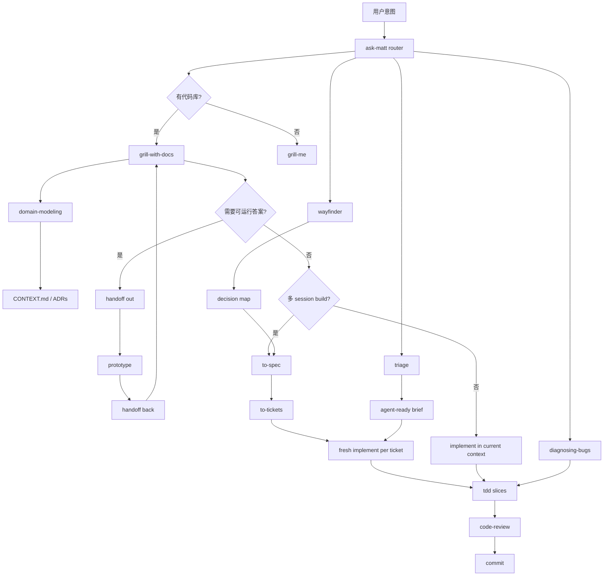
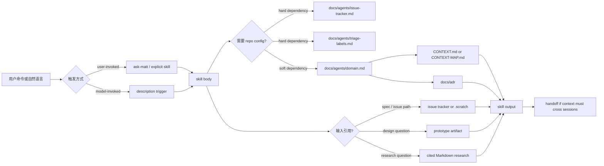

# Nuclio Radical Redesign：Matt Pocock Skills 轻量方法专项分析

> 本报告是已批准 Sequential 研究管线的 Task 3：在 Nuclio 基线与 Trellis 专项之后，对 `mattpocock/skills` 做独立深读。本文只分析该仓库在记录版本的真实形态，不把它强行描述成端到端 SDD 系统，也不执行任何 Nuclio 重构。

## 1. 项目定位与版本证据

- **研究对象**：`https://github.com/mattpocock/skills`
- **本地克隆路径**：`[redacted-local-path]/.claude/jobs/00bd17fd/tmp/nuclio-mattpocock-skills-research`
- **默认分支**：`main`
- **分析 HEAD**：`9603c1cc8118d08bc1b3bf34cf714f62178dea3b`
- **盘点范围**：README、Claude Code plugin manifest、promoted skills、非 promoted buckets、skill-local references/templates、dev-only scripts、项目 ADR、changeset 元数据与 package scripts；README 只作为入口索引，核心结论均回查实际文件。

Matt Pocock Skills 的真实形态是 **可组合 agent skills 能力库 + 可选插件分发**，不是完整 SDD runtime，不是完整 SDD 工作流，也不是带强制状态机的开发平台。README 明确反对 GSD/BMAD/Spec-Kit 这类“owning the process”的方式，主张 small、adaptable、composable skills（`README.md:15-19`，[URL](https://github.com/mattpocock/skills/blob/9603c1cc8118d08bc1b3bf34cf714f62178dea3b/README.md#L15-L19)）。Claude Code plugin metadata 将其描述为 “grilling, spec/ticket flows, TDD, code review, domain modelling and more”，并通过显式 skill 路径数组只发布 promoted set（`.claude-plugin/plugin.json:2-44`，[URL](https://github.com/mattpocock/skills/blob/9603c1cc8118d08bc1b3bf34cf714f62178dea3b/.claude-plugin/plugin.json#L2-L44)）。仓库 ADR 也说明它同时保留 `skills.sh` 复制式安装与 Claude Code plugin 订阅式安装两种哲学：前者可 fork/edit，后者 read-only、managed bundle（`.agents/adr/0002-ship-as-a-claude-code-plugin.md:1-23`，[URL](https://github.com/mattpocock/skills/blob/9603c1cc8118d08bc1b3bf34cf714f62178dea3b/.agents/adr/0002-ship-as-a-claude-code-plugin.md#L1-L23)）。

**定位判断**：它有 spec、tickets、TDD、review、wayfinding、domain docs 等工程实践，但这些是可组合技能和文本约定；仓库没有 Nuclio/Trellis 那样的中心 Controller、file-backed Gate 状态、canonical ownership contract、snapshot/fingerprint freshness 或统一 change lifecycle。存在状态机制的地方是局部的：例如 `/triage` 的 issue label roles（`triage/SKILL.md:24-45`，[URL](https://github.com/mattpocock/skills/blob/9603c1cc8118d08bc1b3bf34cf714f62178dea3b/skills/engineering/triage/SKILL.md#L24-L45)）和 `/wayfinder` 的 tracker map/tickets（`wayfinder/SKILL.md:19-72`，[URL](https://github.com/mattpocock/skills/blob/9603c1cc8118d08bc1b3bf34cf714f62178dea3b/skills/engineering/wayfinder/SKILL.md#L19-L72)），不是覆盖所有变更的 SDD 状态机。

## 2. 仓库结构与能力盘点

### 2.1 Promoted skills 与触发分类

`.claude-plugin/plugin.json` 只列出 22 个 promoted skills，横跨 `skills/engineering/` 与 `skills/productivity/`，不发布 `deprecated/`、`in-progress/`、`personal/`、`misc/` buckets（`.claude-plugin/plugin.json:21-44`，[URL](https://github.com/mattpocock/skills/blob/9603c1cc8118d08bc1b3bf34cf714f62178dea3b/.claude-plugin/plugin.json#L21-L44)；`.agents/adr/0002-ship-as-a-claude-code-plugin.md:7-17`，[URL](https://github.com/mattpocock/skills/blob/9603c1cc8118d08bc1b3bf34cf714f62178dea3b/.agents/adr/0002-ship-as-a-claude-code-plugin.md#L7-L17)）。README 将 skills 分成 **User-invoked** 与 **Model-invoked**：user-invoked skills 由用户显式输入命令并负责 orchestrate；model-invoked skills 可由用户或 agent 自动触发并承载 reusable discipline（`README.md:169-198`，[URL](https://github.com/mattpocock/skills/blob/9603c1cc8118d08bc1b3bf34cf714f62178dea3b/README.md#L169-L198)）。

| Bucket | User-invoked promoted skills | Model-invoked promoted skills | 证据 |
|---|---|---|---|
| Engineering | `ask-matt`、`grill-with-docs`、`triage`、`improve-codebase-architecture`、`setup-matt-pocock-skills`、`to-spec`、`to-tickets`、`implement`、`wayfinder` | `prototype`、`diagnosing-bugs`、`research`、`tdd`、`domain-modeling`、`codebase-design`、`code-review`、`resolving-merge-conflicts` | README promoted list（`README.md:173-198`，[URL](https://github.com/mattpocock/skills/blob/9603c1cc8118d08bc1b3bf34cf714f62178dea3b/README.md#L173-L198)）；frontmatter 中 `disable-model-invocation: true` 标记 user-only，例如 `implement/SKILL.md:1-5`（[URL](https://github.com/mattpocock/skills/blob/9603c1cc8118d08bc1b3bf34cf714f62178dea3b/skills/engineering/implement/SKILL.md#L1-L5)） |
| Productivity | `grill-me`、`handoff`、`teach`、`writing-great-skills` | `grilling` | README productivity list（`README.md:200-213`，[URL](https://github.com/mattpocock/skills/blob/9603c1cc8118d08bc1b3bf34cf714f62178dea3b/README.md#L200-L213)） |

### 2.2 命令、模板、references、examples、scripts

| 类型 | 实际内容 | 作用 | 证据 |
|---|---|---|---|
| 安装入口 | `npx skills@latest add mattpocock/skills`；或 Claude plugin marketplace/install 命令 | 安装 skills；随后运行 `/setup-matt-pocock-skills` | `README.md:25-65`（[URL](https://github.com/mattpocock/skills/blob/9603c1cc8118d08bc1b3bf34cf714f62178dea3b/README.md#L25-L65)） |
| Plugin manifest | `.claude-plugin/plugin.json`、`.claude-plugin/marketplace.json` | 原生 Claude Code plugin 分发，显式列出 promoted skill dirs | `.claude-plugin/plugin.json:21-44`（[URL](https://github.com/mattpocock/skills/blob/9603c1cc8118d08bc1b3bf34cf714f62178dea3b/.claude-plugin/plugin.json#L21-L44)）；`.claude-plugin/marketplace.json:8-22`（[URL](https://github.com/mattpocock/skills/blob/9603c1cc8118d08bc1b3bf34cf714f62178dea3b/.claude-plugin/marketplace.json#L8-L22)） |
| Per-repo setup templates | `issue-tracker-github.md`、`issue-tracker-gitlab.md`、`issue-tracker-local.md`、`triage-labels.md`、`domain.md` | 写入 `docs/agents/*.md` 与 `CLAUDE.md`/`AGENTS.md` 中的 `## Agent skills` block | `setup-matt-pocock-skills/SKILL.md:63-116`（[URL](https://github.com/mattpocock/skills/blob/9603c1cc8118d08bc1b3bf34cf714f62178dea3b/skills/engineering/setup-matt-pocock-skills/SKILL.md#L63-L116)） |
| Skill-local references | `CONTEXT-FORMAT.md`、`ADR-FORMAT.md`、`tests.md`、`mocking.md`、`LOGIC.md`、`UI.md`、`HTML-REPORT.md`、`GLOSSARY.md` 等 | progressive disclosure：只有分支需要时才加载 | `writing-great-skills/SKILL.md:30-45`（[URL](https://github.com/mattpocock/skills/blob/9603c1cc8118d08bc1b3bf34cf714f62178dea3b/skills/productivity/writing-great-skills/SKILL.md#L30-L45)） |
| 本地问题/任务约定 | `.scratch/<feature>/spec.md` 与 `.scratch/<feature>/issues/<NN>-<slug>.md` | 本地 markdown tracker；也支持 GitHub/GitLab/Other tracker | `issue-tracker-local.md:1-30`（[URL](https://github.com/mattpocock/skills/blob/9603c1cc8118d08bc1b3bf34cf714f62178dea3b/skills/engineering/setup-matt-pocock-skills/issue-tracker-local.md#L1-L30)） |
| Dev-only scripts | `scripts/link-skills.sh`、`scripts/list-skills.sh` | 维护者本地链接/枚举 skills；不是用户工作流 runtime | `scripts/link-skills.sh:4-13`（[URL](https://github.com/mattpocock/skills/blob/9603c1cc8118d08bc1b3bf34cf714f62178dea3b/scripts/link-skills.sh#L4-L13)）；`scripts/list-skills.sh:4-7`（[URL](https://github.com/mattpocock/skills/blob/9603c1cc8118d08bc1b3bf34cf714f62178dea3b/scripts/list-skills.sh#L4-L7)） |
| Package scripts | `changeset`、`version` | 版本发布辅助，不是产品执行 engine | `package.json:11-18`（[URL](https://github.com/mattpocock/skills/blob/9603c1cc8118d08bc1b3bf34cf714f62178dea3b/package.json#L11-L18)） |

## 3. 真实使用流程：idea → ship，但不是硬状态机

`ask-matt` 是用户记不住所有 skills 时的 router。它定义主路径：`/grill-with-docs` sharpen idea；必要时经 `/handoff` 去 fresh session 做 `/prototype`；多 session build 走 `/to-spec` → `/to-tickets` → per-ticket `/implement`，且每个 implement 前清空 context；小变更则可直接在同一 context `/implement`（`ask-matt/SKILL.md:13-31`，[URL](https://github.com/mattpocock/skills/blob/9603c1cc8118d08bc1b3bf34cf714f62178dea3b/skills/engineering/ask-matt/SKILL.md#L13-L31)）。它还把 bugs/requests 分流到 `/triage`，把 hard bugs 分流到 `/diagnosing-bugs`，把巨大 foggy effort 分流到 `/wayfinder`（`ask-matt/SKILL.md:34-47`，[URL](https://github.com/mattpocock/skills/blob/9603c1cc8118d08bc1b3bf34cf714f62178dea3b/skills/engineering/ask-matt/SKILL.md#L34-L47)）。

这个流程有“建议顺序”，但不是像 Nuclio 的 `project-init → brief → design → implement → verify → fold` persisted lifecycle。`/implement` 本身只有 9 行正文：基于 spec/tickets 实现，尽量用 `/tdd`，定期 typecheck/test，完成后用 `/code-review`，然后 commit（`implement/SKILL.md:7-15`，[URL](https://github.com/mattpocock/skills/blob/9603c1cc8118d08bc1b3bf34cf714f62178dea3b/skills/engineering/implement/SKILL.md#L7-L15)）。它不包含 task state checkpoint、ownership slice、snapshot lineage 或 Gate approval。`/to-tickets` 要求“Work the frontier one ticket at a time with `/implement`, clearing context between tickets”（`to-tickets/SKILL.md:105-107`，[URL](https://github.com/mattpocock/skills/blob/9603c1cc8118d08bc1b3bf34cf714f62178dea3b/skills/engineering/to-tickets/SKILL.md#L105-L107)），这是一条 context hygiene 约束，不是脚本强制队列。

## 4. 上下文选择与注入：轻量、按需、依赖宿主与用户纪律

Matt Pocock Skills 的上下文装配不是 hook 自动注入或 Controller dispatch package，而是四层文本规则：skill frontmatter description 参与发现，user-invoked router 降低总 context load，`setup` 写 per-repo config，具体 skill 在运行时读取 `CONTEXT.md`/ADRs/issue tracker/spec/ticket 等路径。`writing-great-skills` 明确把 model-invoked description 视为每轮 context load，而 user-invoked skill 只消耗用户 cognitive load；当 user-invoked skills 过多时用 router skill 解决（`writing-great-skills/SKILL.md:11-21`，[URL](https://github.com/mattpocock/skills/blob/9603c1cc8118d08bc1b3bf34cf714f62178dea3b/skills/productivity/writing-great-skills/SKILL.md#L11-L21)）。

关键细节：

1. **Hard vs soft dependency 分层**：ADR 规定 `to-tickets`、`to-spec`、`triage` 这类缺少 issue tracker/label mapping 会输出错误的 skills 才显式要求 `/setup-matt-pocock-skills`；`diagnose`、`tdd`、`improve-codebase-architecture` 只软引用 domain glossary/ADRs，缺失时继续工作但输出不够 sharp（`.agents/adr/0001-explicit-setup-pointer-only-for-hard-dependencies.md:1-10`，[URL](https://github.com/mattpocock/skills/blob/9603c1cc8118d08bc1b3bf34cf714f62178dea3b/.agents/adr/0001-explicit-setup-pointer-only-for-hard-dependencies.md#L1-L10)）。
2. **Setup 写“消费者规则”而非 runtime**：`/setup-matt-pocock-skills` 探索 repo、向用户确认，然后更新 `CLAUDE.md`/`AGENTS.md` 的 `## Agent skills` block 与 `docs/agents/*.md`（`setup-matt-pocock-skills/SKILL.md:63-116`，[URL](https://github.com/mattpocock/skills/blob/9603c1cc8118d08bc1b3bf34cf714f62178dea3b/skills/engineering/setup-matt-pocock-skills/SKILL.md#L63-L116)）。它明确“prompt-driven skill, not a deterministic script”（`setup-matt-pocock-skills/SKILL.md:15`，[URL](https://github.com/mattpocock/skills/blob/9603c1cc8118d08bc1b3bf34cf714f62178dea3b/skills/engineering/setup-matt-pocock-skills/SKILL.md#L15)）。
3. **Domain docs 懒创建**：`domain-modeling` 只有在术语或决策 crystallise 时更新 `CONTEXT.md` 或提供 ADR；没有文件时不预先报错（`domain-modeling/SKILL.md:40-74`，[URL](https://github.com/mattpocock/skills/blob/9603c1cc8118d08bc1b3bf34cf714f62178dea3b/skills/engineering/domain-modeling/SKILL.md#L40-L74)；`setup-matt-pocock-skills/domain.md:5-12`，[URL](https://github.com/mattpocock/skills/blob/9603c1cc8118d08bc1b3bf34cf714f62178dea3b/skills/engineering/setup-matt-pocock-skills/domain.md#L5-L12)）。
4. **Handoff 是 temp 文档，不污染 workspace**：`/handoff` 将当前对话压缩到 OS temp dir，不复制已有 artifacts，只引用路径/URL，并提醒下个 agent 建议使用哪些 skills（`handoff/SKILL.md:8-16`，[URL](https://github.com/mattpocock/skills/blob/9603c1cc8118d08bc1b3bf34cf714f62178dea3b/skills/productivity/handoff/SKILL.md#L8-L16)）。

## 5. 显式与隐式产物：少文档不是无成本

| 分类 | 产物或非产物 | 谁写 | 谁读 | 生命周期 | 恢复/审计价值 | 证据 |
|---|---|---|---|---|---|---|
| 配置产物 | `docs/agents/issue-tracker.md`、`docs/agents/domain.md`、可选 `triage-labels.md`；`CLAUDE.md`/`AGENTS.md` 中 `## Agent skills` block | `/setup-matt-pocock-skills` 经用户确认后写 | 需要 tracker/domain 的 skills | 长期，可手改 | 低成本说明“本 repo 如何使用 skills” | `setup-matt-pocock-skills/SKILL.md:63-116`（[URL](https://github.com/mattpocock/skills/blob/9603c1cc8118d08bc1b3bf34cf714f62178dea3b/skills/engineering/setup-matt-pocock-skills/SKILL.md#L63-L116)） |
| 领域语言 | `CONTEXT.md` 或 `CONTEXT-MAP.md`；`docs/adr/*.md` | `/domain-modeling`、`/grill-with-docs`、`/improve-codebase-architecture` | 多个 engineering skills | 长期，懒创建 | 高：压缩术语与关键决策，减少重复解释 | `domain-modeling/SKILL.md:10-40`、`:60-74`（[URL](https://github.com/mattpocock/skills/blob/9603c1cc8118d08bc1b3bf34cf714f62178dea3b/skills/engineering/domain-modeling/SKILL.md#L10-L40)；[URL](https://github.com/mattpocock/skills/blob/9603c1cc8118d08bc1b3bf34cf714f62178dea3b/skills/engineering/domain-modeling/SKILL.md#L60-L74)） |
| Spec | issue tracker 中的 spec / PRD；local mode 为 `.scratch/<feature>/spec.md` | `/to-spec` | `/to-tickets`、`/implement`、`/code-review` spec axis | 中期，随 feature 存在 | 中：保存用户意图和 testing decisions，但不是 Gate | `to-spec/SKILL.md:7-21`、`:23-75`（[URL](https://github.com/mattpocock/skills/blob/9603c1cc8118d08bc1b3bf34cf714f62178dea3b/skills/engineering/to-spec/SKILL.md#L7-L21)；[URL](https://github.com/mattpocock/skills/blob/9603c1cc8118d08bc1b3bf34cf714f62178dea3b/skills/engineering/to-spec/SKILL.md#L23-L75)） |
| Tickets | tracker issues 或 `.scratch/<feature>/issues/<NN>-<slug>.md` | `/to-tickets` | `/implement` | 中期，per ticket | 中：blocking edges 与 vertical slices 支持 fresh context | `to-tickets/SKILL.md:25-40`、`:58-83`（[URL](https://github.com/mattpocock/skills/blob/9603c1cc8118d08bc1b3bf34cf714f62178dea3b/skills/engineering/to-tickets/SKILL.md#L25-L40)；[URL](https://github.com/mattpocock/skills/blob/9603c1cc8118d08bc1b3bf34cf714f62178dea3b/skills/engineering/to-tickets/SKILL.md#L58-L83)） |
| Wayfinder map | tracker map issue/file + decision tickets | `/wayfinder` | later `/wayfinder` sessions、`/to-spec` | 长 effort 期间 | 高：保存 fog、frontier、closed decision pointers | `wayfinder/SKILL.md:19-72`、`:118-128`（[URL](https://github.com/mattpocock/skills/blob/9603c1cc8118d08bc1b3bf34cf714f62178dea3b/skills/engineering/wayfinder/SKILL.md#L19-L72)；[URL](https://github.com/mattpocock/skills/blob/9603c1cc8118d08bc1b3bf34cf714f62178dea3b/skills/engineering/wayfinder/SKILL.md#L118-L128)） |
| Prototype | throwaway code，提交到 throwaway branch，主线只保留验证过的 decision | `/prototype` | human、后续 issue/context pointer | 短期，不进 main | 中：回答具体设计问题，但需人工清理和引用 | `prototype/SKILL.md:8-26`（[URL](https://github.com/mattpocock/skills/blob/9603c1cc8118d08bc1b3bf34cf714f62178dea3b/skills/engineering/prototype/SKILL.md#L8-L26)） |
| Research | 单个 cited Markdown file | `/research` background agent | 主 flow、spec/tickets | 中期或长期，按 repo convention | 高：一手来源引用 | `research/SKILL.md:6-12`（[URL](https://github.com/mattpocock/skills/blob/9603c1cc8118d08bc1b3bf34cf714f62178dea3b/skills/engineering/research/SKILL.md#L6-L12)） |
| Review report | `/code-review` 聚合 Standards 与 Spec 两个 sub-agent reports | `/code-review` | 当前用户/实现者 | 会话输出为主，是否落盘取决于用户 | 中：分离标准与需求轴，但不是 persisted Gate | `code-review/SKILL.md:15-80`（[URL](https://github.com/mattpocock/skills/blob/9603c1cc8118d08bc1b3bf34cf714f62178dea3b/skills/engineering/code-review/SKILL.md#L15-L80)） |
| 非产物 | 中心 state、Gate ledger、snapshot/fingerprint、ownership contract、helper-enforced mutation allowlist | 不存在 | 不存在 | 不适用 | 不能提供 Nuclio 式恢复/审计/mutation safety | absence 由 `implement/SKILL.md` 的极简流程与无 helper/state 文件共同证明（[URL](https://github.com/mattpocock/skills/blob/9603c1cc8118d08bc1b3bf34cf714f62178dea3b/skills/engineering/implement/SKILL.md#L7-L15)） |

少文档设计依赖了三类外部能力或纪律：

1. **Claude Code / Agent Skills 宿主能力**：skill discovery、model-invoked description、user slash command、Task/sub-agent、git/tool access由宿主提供，仓库不实现这些运行时。
2. **用户纪律**：用户必须先运行 setup、在每个 `/to-tickets` 后按 ticket fresh context 实现、在 `/code-review` 前给 fixed point、在 Wayfinder 中一次只解决一个 ticket。
3. **模型遵循 prompt 的能力**：例如 `/grilling` 要一次一个问题并等待反馈（`grilling/SKILL.md:6-12`，[URL](https://github.com/mattpocock/skills/blob/9603c1cc8118d08bc1b3bf34cf714f62178dea3b/skills/productivity/grilling/SKILL.md#L6-L12)），`/diagnosing-bugs` 要先构造 tight red-capable feedback loop 再假设（`diagnosing-bugs/SKILL.md:12-60`，[URL](https://github.com/mattpocock/skills/blob/9603c1cc8118d08bc1b3bf34cf714f62178dea3b/skills/engineering/diagnosing-bugs/SKILL.md#L12-L60)），这些没有脚本强制。

## 6. Prompt / skill 编写方法：高信噪比来自分层与 leading words

### 6.1 Progressive disclosure 与信息层级

`writing-great-skills` 把 skill 内容分为 in-skill steps、in-skill reference、external reference，并把 progressive disclosure 定义为把只在某分支需要的材料放到 linked `.md` 文件，由 context pointer 按需触发（`writing-great-skills/SKILL.md:30-45`，[URL](https://github.com/mattpocock/skills/blob/9603c1cc8118d08bc1b3bf34cf714f62178dea3b/skills/productivity/writing-great-skills/SKILL.md#L30-L45)）。这一点在多个 skill 中可见：`/tdd` 主体只放原则和 loop，测试/Mock 细节在 `tests.md`、`mocking.md`（`tdd/SKILL.md:12-17`，[URL](https://github.com/mattpocock/skills/blob/9603c1cc8118d08bc1b3bf34cf714f62178dea3b/skills/engineering/tdd/SKILL.md#L12-L17)）；`/prototype` 把 UI/logic 分支推到 `UI.md`/`LOGIC.md`（`prototype/SKILL.md:10-18`，[URL](https://github.com/mattpocock/skills/blob/9603c1cc8118d08bc1b3bf34cf714f62178dea3b/skills/engineering/prototype/SKILL.md#L10-L18)）；`/improve-codebase-architecture` 把 HTML scaffold 推到 `HTML-REPORT.md`（`improve-codebase-architecture/SKILL.md:37-60`，[URL](https://github.com/mattpocock/skills/blob/9603c1cc8118d08bc1b3bf34cf714f62178dea3b/skills/engineering/improve-codebase-architecture/SKILL.md#L37-L60)）。

### 6.2 Leading words 与压缩语义

该仓库偏好用强词绑定复杂行为，例如 `grilling`、`tracer bullet`、`frontier`、`fog of war`、`tight feedback loop`、`deep module`、`seam`、`red/green`。`writing-great-skills` 明确说 leading word 能借用模型预训练概念，在更少 token 中锚定执行和 invocation（`writing-great-skills/SKILL.md:61-72`，[URL](https://github.com/mattpocock/skills/blob/9603c1cc8118d08bc1b3bf34cf714f62178dea3b/skills/productivity/writing-great-skills/SKILL.md#L61-L72)）。`codebase-design` 也将术语设为硬要求：必须说 module/interface/seam/adapter/depth，不替换成 component/service/API/boundary（`codebase-design/SKILL.md:10-28`，[URL](https://github.com/mattpocock/skills/blob/9603c1cc8118d08bc1b3bf34cf714f62178dea3b/skills/engineering/codebase-design/SKILL.md#L10-L28)）。

### 6.3 Completion criteria 多为行为性，不是状态性

TDD 要求“red before green”“one slice at a time”“refactoring belongs to review stage”（`tdd/SKILL.md:32-36`，[URL](https://github.com/mattpocock/skills/blob/9603c1cc8118d08bc1b3bf34cf714f62178dea3b/skills/engineering/tdd/SKILL.md#L32-L36)）。Diagnosing-bugs 规定 Phase 1 完成标准是已经运行过一个 tight、red-capable、deterministic、fast、agent-runnable command（`diagnosing-bugs/SKILL.md:51-60`，[URL](https://github.com/mattpocock/skills/blob/9603c1cc8118d08bc1b3bf34cf714f62178dea3b/skills/engineering/diagnosing-bugs/SKILL.md#L51-L60)）。这些是很强的行为门槛，但没有 Nuclio 的 file-backed Gate approval 或 helper guard；因此失败恢复靠可观察命令、issue/spec/context artifacts 与用户 review，而不是状态机重放。

## 7. 轻量化取舍：优点、代价、边界

### 7.1 优点

1. **Token efficiency**：user-invoked skills 不进入 model description context；soft dependency skills 不重复 setup 指针；reference 下沉到 sibling files。证据：`writing-great-skills/SKILL.md:11-21` 与 hard/soft dependency ADR（[URL](https://github.com/mattpocock/skills/blob/9603c1cc8118d08bc1b3bf34cf714f62178dea3b/skills/productivity/writing-great-skills/SKILL.md#L11-L21)、[URL](https://github.com/mattpocock/skills/blob/9603c1cc8118d08bc1b3bf34cf714f62178dea3b/.agents/adr/0001-explicit-setup-pointer-only-for-hard-dependencies.md#L1-L10)）。
2. **组合性**：`ask-matt` 把 flows 明确为 skill graph，而不是强制 pipeline；`grill-with-docs` 仅“Run a `/grilling` session, using `/domain-modeling`”（`grill-with-docs/SKILL.md:7`，[URL](https://github.com/mattpocock/skills/blob/9603c1cc8118d08bc1b3bf34cf714f62178dea3b/skills/engineering/grill-with-docs/SKILL.md#L7)），体现可复用 primitive。
3. **维护性**：小 skill + single source of truth + pruning/no-op 检查降低 prompt sediment（`writing-great-skills/SKILL.md:53-60`、`:74-83`，[URL](https://github.com/mattpocock/skills/blob/9603c1cc8118d08bc1b3bf34cf714f62178dea3b/skills/productivity/writing-great-skills/SKILL.md#L53-L60)、[URL](https://github.com/mattpocock/skills/blob/9603c1cc8118d08bc1b3bf34cf714f62178dea3b/skills/productivity/writing-great-skills/SKILL.md#L74-L83)）。
4. **人类控制感**：README 明确把这些 skills 设计成 small、easy to adapt、composable，以避免被流程夺走控制（`README.md:17-19`，[URL](https://github.com/mattpocock/skills/blob/9603c1cc8118d08bc1b3bf34cf714f62178dea3b/README.md#L17-L19)）。
5. **高信噪比实践沉淀**：例如 TDD seam、diagnosis loop、domain glossary、deep module vocabulary 都是可跨项目复用的 engineering primitives。

### 7.2 代价

1. **恢复能力有限**：没有 per-task dispatch tuple、snapshot lineage、state machine 或 current_task 指针。多 session 的恢复主要靠 issue/spec/tickets、Wayfinder map 和 `/handoff` 文档。
2. **审计性弱于 file-backed SDD**：`/code-review` 可做双轴审查，但它聚合 reports 后不形成 Gate；没有 change-wide Verify Gate、artifact hash 或 global product fingerprint。
3. **mutation safety 依赖模型和用户**：`/implement` 会 commit，但没有授权路径 allowlist；`/prototype` 甚至建议把原型提交到 throwaway branch 并留下 context pointer（`prototype/SKILL.md:26`，[URL](https://github.com/mattpocock/skills/blob/9603c1cc8118d08bc1b3bf34cf714f62178dea3b/skills/engineering/prototype/SKILL.md#L26)），这需要用户理解分支/主线边界。
4. **复杂任务可靠性有边界**：Wayfinder 能处理巨大 foggy effort，但其 map/tickets 依赖 issue tracker 与 prompt discipline；它明确“Plan, don't do”，最后仍要 hand off 到 `/to-spec`，不能直接当执行控制器（`wayfinder/SKILL.md:11-14`、`:44-47`，[URL](https://github.com/mattpocock/skills/blob/9603c1cc8118d08bc1b3bf34cf714f62178dea3b/skills/engineering/wayfinder/SKILL.md#L11-L14)、[URL](https://github.com/mattpocock/skills/blob/9603c1cc8118d08bc1b3bf34cf714f62178dea3b/skills/engineering/wayfinder/SKILL.md#L44-L47)）。

### 7.3 适用边界

| 适用场景 | 为什么适合 | 不适合场景 |
|---|---|---|
| 单人或小团队日常工程 | 低 ceremony、可手改、可组合，用户保留控制 | 需要强审计、强合规、可重放 Gate 的变更 |
| 中小型 feature 从想法到 tickets | `/grill-with-docs` + `/to-spec` + `/to-tickets` 足够清晰 | 多 owner、多 handoff、多路径 mutation 的高风险变更 |
| Bug diagnosis / TDD / architecture review | 每个 skill 封装一个高价值 engineering loop | 需要证明所有 acceptance、所有 Task evidence 的 change-wide verification |
| 巨大但仍以决策为主的 foggy work | `/wayfinder` map/tickets 保存决策 frontier | 已进入 implementation 且需要 deterministic task orchestration 的阶段 |

## 8. 与 Nuclio、Trellis 的初步差异

| 维度 | Matt Pocock Skills | Trellis | 当前 Nuclio |
|---|---|---|---|
| 系统形态 | 可组合 skill 能力库；plugin/skills.sh 分发；无中心 runtime | SDD 工作流层，`trellis init` 生成 `.trellis/`、hooks、task artifacts、commands/agents | Claude Code plugin 中的 file-backed lightweight SDD lifecycle |
| 主流程 | Router 建议 idea → grill → spec/tickets → implement/TDD/review/commit；可跳转 | Plan → Execute → Finish；由 task artifacts、hooks、scripts 和 journal 串联 | `project-init → brief → design → implement → verify → fold`，当前仓库说明如此定义（`CLAUDE.md:97`） |
| 上下文注入 | Skill description + explicit command + per-repo docs + on-demand reads | hooks 注入 workflow breadcrumb 与 sub-agent manifest；Task 2 报告记录 `implement.jsonl/check.jsonl` 与 hooks（`nuclio-trellis-analysis.md:65-108`） | bounded context manifests，Implement/Verify 按 `references/context-manifest.md` 加载（`plugins/nuclio-plugin/skills/implement/SKILL.md:20`、`plugins/nuclio-plugin/skills/verify/SKILL.md:15`） |
| 状态 | 局部：issue labels、Wayfinder map/tickets；无全局 change state | `task.json.status`、session pointers、archive/journal；Task 2 报告记录状态转换（`nuclio-trellis-analysis.md:51-63`） | `.dev-docs/changes/<id>/state.json` 与 Gate/approved contract/evidence 为 authority；当前基线报告说明 `.dev-docs/` 与 state 是事实源（`nuclio-current-state-analysis.md:9-16`） |
| Mutation safety | TDD、review、commit discipline；无 allowlist | prompt protocol + dirty file discipline + hooks/scripts | `mutation_targets` hard boundary、fresh reviewer、snapshots/fingerprints；Implement 明确 worker 只能改 approved targets（`plugins/nuclio-plugin/skills/implement/SKILL.md:14-18`） |
| 人工 Gate | 主要是确认问题、approval breakdown、review fixed point | 多处 soft Gate 和 artifact review | Brief/Design/Verify/Fold explicit Gate；artifact existence 不等于 approval（`plugins/nuclio-plugin/skills/verify/SKILL.md:20-21`） |
| 知识沉淀 | `CONTEXT.md`、ADRs、research files、learning docs，懒创建 | `.trellis/spec`、task archive、journal | `.dev-docs` baseline/change evidence/Fold proposal-first apply |

## 9. Nuclio 可借鉴分类

### 9.1 可直接借鉴

1. **User-invoked router 降低认知负担**：Nuclio 可以引入类似 `ask-matt` 的轻量路由说明或合并入口提示，把“我现在该用 brief/design/verify/fold 哪个”做成短文档/skill，而不是在每个阶段重复大段 lifecycle。理由：不改变 Nuclio Gate/state，只改善发现与用户控制。证据：`ask-matt/SKILL.md:7-12`、`:76-78`（[URL](https://github.com/mattpocock/skills/blob/9603c1cc8118d08bc1b3bf34cf714f62178dea3b/skills/engineering/ask-matt/SKILL.md#L7-L12)、[URL](https://github.com/mattpocock/skills/blob/9603c1cc8118d08bc1b3bf34cf714f62178dea3b/skills/engineering/ask-matt/SKILL.md#L76-L78)）。
2. **Hard/soft dependency 分层**：Nuclio 可把必须阻断的 authority inputs 与仅提高清晰度的 context inputs 明确分层，减少每个 skill 都重复“读全部 protocol”的 token。理由：不移除 mutation safety，只把不可缺失和可降级区分清楚。证据：hard/soft ADR（[URL](https://github.com/mattpocock/skills/blob/9603c1cc8118d08bc1b3bf34cf714f62178dea3b/.agents/adr/0001-explicit-setup-pointer-only-for-hard-dependencies.md#L1-L10)）。
3. **Leading words 与统一词汇**：Nuclio 的 ownership、handoff、Gate、snapshot、freshness 可以通过更少更强的 canonical terms 表达，避免同义句堆叠。理由：Matt 的 `codebase-design` 展示了词汇约束如何压缩行为并减少 drift。证据：`codebase-design/SKILL.md:10-28`（[URL](https://github.com/mattpocock/skills/blob/9603c1cc8118d08bc1b3bf34cf714f62178dea3b/skills/engineering/codebase-design/SKILL.md#L10-L28)）。
4. **Lazily created glossary/ADR 思路**：Nuclio Fold 可保留 approval-first，但在 Brief/Design 期间只在术语或决策真正 crystallise 时沉淀，避免提前创建空模板。理由：不移除持久事实源，只减少空文档。证据：`domain-modeling/SKILL.md:40-74`（[URL](https://github.com/mattpocock/skills/blob/9603c1cc8118d08bc1b3bf34cf714f62178dea3b/skills/engineering/domain-modeling/SKILL.md#L40-L74)）。

### 9.2 需改造借鉴

1. **`grilling` 的一次一个问题 + 推荐答案**：Nuclio 已有 Grill 约束，但可学习其极简 prompt；必须改造成 Nuclio 的 artifact-backed confirmed answers，不可停留在 chat。Matt 的 `/grilling` 明确不行动直到 shared understanding（`grilling/SKILL.md:6-12`，[URL](https://github.com/mattpocock/skills/blob/9603c1cc8118d08bc1b3bf34cf714f62178dea3b/skills/productivity/grilling/SKILL.md#L6-L12)）。
2. **`to-tickets` tracer bullets 与 blocking edges**：Nuclio Design 可借鉴 vertical slice 和 blockers-first 表达，但必须继续由 `plan.yaml`、approved ownership contract 与 helper validation 承载 authority，不能只写自然语言 tickets。证据：`to-tickets/SKILL.md:25-40`、`:58-67`（[URL](https://github.com/mattpocock/skills/blob/9603c1cc8118d08bc1b3bf34cf714f62178dea3b/skills/engineering/to-tickets/SKILL.md#L25-L40)、[URL](https://github.com/mattpocock/skills/blob/9603c1cc8118d08bc1b3bf34cf714f62178dea3b/skills/engineering/to-tickets/SKILL.md#L58-L67)）。
3. **`wayfinder` 的 fog/frontier/map**：Nuclio 可在 Design 前或大 change discovery 中采用 decision map；但 Implement 阶段不能让 frontier issue 替代 approved contract、snapshot lineage 或 Gate。证据：`wayfinder/SKILL.md:82-101`、`:118-128`（[URL](https://github.com/mattpocock/skills/blob/9603c1cc8118d08bc1b3bf34cf714f62178dea3b/skills/engineering/wayfinder/SKILL.md#L82-L101)、[URL](https://github.com/mattpocock/skills/blob/9603c1cc8118d08bc1b3bf34cf714f62178dea3b/skills/engineering/wayfinder/SKILL.md#L118-L128)）。
4. **`code-review` 双轴 reviewer**：Nuclio task reviewer / Verify 可借鉴 Standards vs Spec 分离，避免一个轴掩盖另一个轴；但 Nuclio 必须保留 reviewer/fixer bounded tools、change-wide Verify Gate 和 evidence snapshots。证据：`code-review/SKILL.md:6-13`、`:76-89`（[URL](https://github.com/mattpocock/skills/blob/9603c1cc8118d08bc1b3bf34cf714f62178dea3b/skills/engineering/code-review/SKILL.md#L6-L13)、[URL](https://github.com/mattpocock/skills/blob/9603c1cc8118d08bc1b3bf34cf714f62178dea3b/skills/engineering/code-review/SKILL.md#L76-L89)）。
5. **Prompt-driven setup**：Nuclio 可以简化 project-init 的交互为探索→建议→确认→写入，但必须保留 `.dev-docs` source-of-truth、Gate STOP 和 helper validation。Matt setup 不是 deterministic script（`setup-matt-pocock-skills/SKILL.md:15`，[URL](https://github.com/mattpocock/skills/blob/9603c1cc8118d08bc1b3bf34cf714f62178dea3b/skills/engineering/setup-matt-pocock-skills/SKILL.md#L15)），Nuclio 不能完全照搬。

### 9.3 不适用于 Nuclio

1. **把 `/implement` 缩成几行并直接 commit**：Matt 的 `/implement` 没有 ownership allowlist、state authority、snapshot/fingerprint 或 Gate；Nuclio 的 mutation safety 明确要求 Controller 负责 state、ownership、snapshot、evidence persistence，worker/reviewer 不决定 Gate/Task completion/mutation 权限（`plugins/nuclio-plugin/skills/implement/SKILL.md:11-18`）。
2. **仅用 issue tracker 状态替代 file-backed Gate**：`triage` labels 和 Wayfinder tracker map 对协作有用，但不能替代 Nuclio Verify/Fold 的 explicit approval。Nuclio Verify 明确 artifact existence is not Gate approval，只有当前轮用户 explicit accept 才能批准（`plugins/nuclio-plugin/skills/verify/SKILL.md:20-21`）。
3. **无状态 handoff 作为恢复机制**：`/handoff` 写 temp doc，适合跨 context，而 Nuclio 需要可审查、可恢复、可追溯的 `.dev-docs` change evidence；仅靠 temp handoff 会丢失 authority。
4. **依赖 background agent 自主研究而无 bounded evidence contract**：Matt `/research` 可以写 cited Markdown，但 Nuclio 在 Implement/Verify 中不能让 worker 自行扩大上下文或把研究输出当 mutation authority。

## 10. 面向 Task 4 的结论

Matt Pocock Skills 给 Nuclio 的最大启发不是“删除 SDD”，而是 **把 SDD 的必要硬边界收缩到真正需要 authority 的位置，把其他工程实践拆成小而可组合的 high-signal skills**。Nuclio 不应复制其无中心状态的实现方式，但应吸收以下轻量化原则：

1. **硬边界少而硬**：Gate、ownership、mutation、snapshot、Verify/Fold approval 继续 file-backed；非 authority 的建议、术语、grilling、review heuristics 下沉为 references 或 model-invoked primitives。
2. **Skill body 只放当前分支必需内容**：把长 protocol 拆成“必读 guards + context pointer”，让 helper/protocol 文件承载算法 authority。
3. **用 router 与 leading words 降低 cognitive/token load**：让用户知道何时进入哪个阶段，让模型用稳定词汇思考。
4. **文档懒创建但事实不丢失**：术语/ADR/knowledge 在决策落地时写，不为形式提前铺模板；但 change evidence、approval、verification 不能省。
5. **复杂任务先 map 决策，再 collapse 成可执行 contract**：Wayfinder 式 decision map 可成为 Nuclio Design 前置探索，但最终必须 collapse 到 Nuclio 的 bounded Plan/ownership/context manifests。

因此，在 Task 4 综合方案中，Matt Pocock Skills 应作为“prompt 轻量化、组合式技能、上下文分层、术语压缩”的正样本；Trellis 更适合作为“工作流层与上下文注入”的比较样本；当前 Nuclio 则保留“file-backed authority、mutation safety、change-wide verification、approval-first knowledge folding”的不可替代安全核心。
