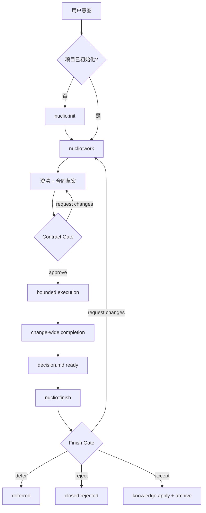
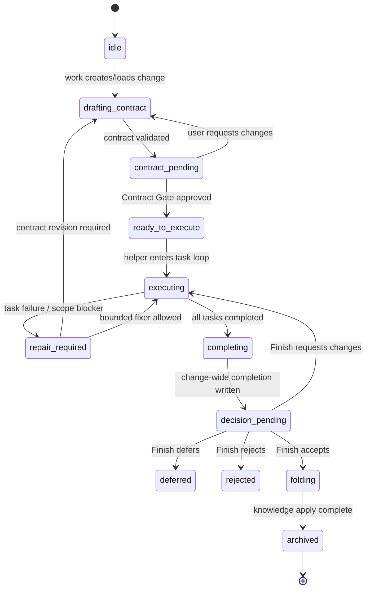
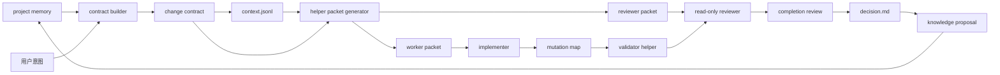
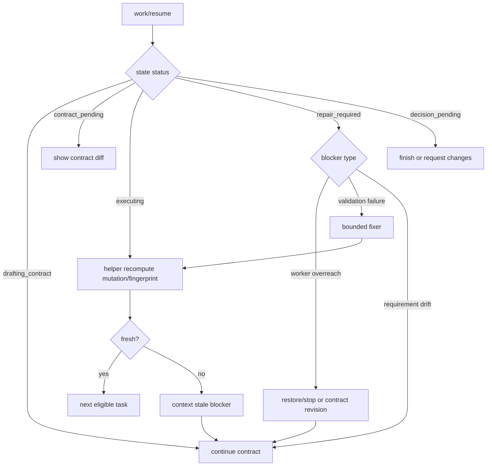

# Nuclio 首选重构方案：从六阶段协议到 Contract Workbench

> 本文是已批准 Sequential 研究管线的 Task 4 综合阶段输出。本文消费三份已审查报告：Nuclio 当前实现基线、Trellis SDD 架构专项、Matt Pocock Skills 轻量方法专项；必要处回查当前仓库与固定外部 clones 的原始文件。本文不执行 Nuclio 重构，只给出后续重写决策依据。

## 0. 结论先行

### 0.1 唯一首选

**建议重写 Nuclio 为 `Contract Workbench`：一套 `init + work + finish` 的三入口架构，其中普通 change 只需要 `/nuclio:work` 与 `/nuclio:finish` 两个用户可见命令。**

- `/nuclio:init`：一次性建立或修复项目事实源，不参与每个 change 的日常路径。
- `/nuclio:work <intent>`：把当前 `brief → design → implement → verify` 收敛为一个 Contract 工作台：澄清意图、生成/修订 `contract.yaml`、取得 **Contract Gate** 后执行 bounded Tasks，并在同一控制器内生成 change-wide completion review。
- `/nuclio:finish`：把当前 `verify approval → fold proposal → apply/archive` 收敛为一个 Decision 工作台：用户只审一个 `decision.md`，可 `accept / request changes / defer / reject`；只有 `accept` 才允许知识沉淀与归档。

这不是把六阶段换名，而是删除四个用户入口、把五个显式 Gate 压缩为两个必须存在的用户 Gate：

1. **Contract Gate**：用户批准意图、验收、任务/ownership/context 合同后才允许产品 mutation。
2. **Finish Gate**：用户批准 change-wide completion 与 knowledge proposal 后才允许长期知识写入与归档。

内部仍保留六项不可削减能力：**持久化事实源、显式意图边界、bounded context、change-wide completion、可审查知识沉淀、mutation safety**。差别是：这些能力不再要求用户逐个调用 `brief/design/implement/verify/fold`，也不再要求主 prompt 重复所有机械协议。

### 0.2 为什么当前 Nuclio “重”

**事实**：当前 Nuclio 将生命周期固化为 `/nuclio:project-init → /nuclio:brief → /nuclio:design → /nuclio:implement → /nuclio:verify → /nuclio:fold` 六个入口（`nuclio-current-state-analysis.md:7`，原始说明 `CLAUDE.md:27`、`CLAUDE.md:97`）。其事实源边界、Gate 语义、bounded context、mutation targets、Verify、Fold 都有明确协议（`nuclio-current-state-analysis.md:9-16`）。

**推论**：重的根源不是“有文档”，而是三层职责没有分离：

1. 用户必须记住六个入口和每个 Gate；
2. Controller prompt 亲自描述大量 deterministic transition；
3. 安全规则在 skill、reference、agent、helper、eval 文案中重复。

**建议**：保留安全语义，删除用户可见阶段；把 deterministic 复杂性下沉到 helpers/schema，把 prompt 缩成高信噪比路由和判定。

### 0.3 目标量化

| 指标 | 当前 Nuclio | 首选目标 |
|---|---:|---:|
| 用户可见入口 | 6 个 | 3 个，其中日常 change 2 个 |
| 普通 change 用户 Gate | Brief、Design、Verify、Fold，另有 init 场景 Gate | Contract、Finish |
| 核心 change 控制文档 | `brief.md`、`spec.md`、`design.md`、`plan.yaml`、`context/implement.jsonl`、`context/verify.jsonl`、多份 evidence | `contract.yaml`、`context.jsonl`、`state.json`、`decision.md`、必要 task evidence |
| 主 prompt 重复安全语 | 多入口重复 | 单一 `authority.md` + helper/schema probe + 短引用 |
| mutation safety | 强 | 强，且更多由 helper 验证 |
| change-wide completion | Verify 独立入口 | `/nuclio:work` 内部完成并写入 `decision.md`；用户在 `/nuclio:finish` 审批 |

## 1. 证据边界与标签

### 1.1 已消费输入

- Nuclio 当前实现基线：`nuclio-current-state-analysis.md`。
- Trellis 专项：`nuclio-trellis-analysis.md`，分析 SHA `51a5674ce6ce5a12cb585c5dcb21e7b76a51bdbc`（`nuclio-trellis-analysis.md:7-11`）。
- Matt Pocock Skills 专项：`nuclio-mattpocock-skills-analysis.md`，分析 SHA `9603c1cc8118d08bc1b3bf34cf714f62178dea3b`（`nuclio-mattpocock-skills-analysis.md:7-11`）。

### 1.2 本文标签约定

- **事实**：来自三份报告或原始文件，可按 path:line / permalink 回查。
- **推论**：基于事实对 Nuclio 复杂性、风险或迁移成本的判断。
- **建议**：目标架构和迁移路线；不是当前已实现能力。

## 2. 三方统一矩阵

| 维度 | 当前 Nuclio | Trellis | Matt Pocock Skills | 对 Nuclio 目标的含义 |
|---|---|---|---|---|
| 项目定位 | **事实**：Claude Code marketplace plugin，file-backed lifecycle + lightweight SDD（`nuclio-current-state-analysis.md:7-16`）。 | **事实**：可安装到项目内的 SDD 工作流层，`trellis init` 生成 `.trellis/`、hooks、agents、commands（`nuclio-trellis-analysis.md:13`）。 | **事实**：可组合 agent skills 能力库，不是端到端 SDD runtime（`nuclio-mattpocock-skills-analysis.md:13-15`）。 | **建议**：Nuclio 不应复制 Trellis 本地 runtime，也不应退化为无状态 skills；应保留 plugin 形态但重写生命周期入口。 |
| 用户入口 | **事实**：六个 `/nuclio:*` 入口（`nuclio-current-state-analysis.md:20-29`）。 | **事实**：Plan → Execute → Finish 三段，另有 CLI/commands（`nuclio-trellis-analysis.md:15-17`）。 | **事实**：router `ask-matt` 分流到 grill/spec/tickets/implement/review（`nuclio-mattpocock-skills-analysis.md:40-42`）。 | **建议**：采用三入口，日常 change 两入口；用 `/nuclio:work` 吸收 router + controller。 |
| lifecycle | **事实**：`project-init → brief → design → implement → verify → fold`（`nuclio-current-state-analysis.md:58-83`）。 | **事实**：`Plan → Execute → Finish`，task 状态从 planning 到 in_progress 到 archive（`nuclio-trellis-analysis.md:17-18`、`:51-63`）。 | **事实**：建议顺序而非硬状态机；idea → grill → spec/tickets → implement（`nuclio-mattpocock-skills-analysis.md:77`）。 | **建议**：外部 lifecycle 降为 init/work/finish；内部 state 保留 contract、execution、decision、archive。 |
| Gate | **事实**：Project Init、Brief、Design、Verify、Fold 明确 STOP；artifact existence 不是 approval（`nuclio-current-state-analysis.md:76-83`）。 | **事实**：任务创建、start、commit plan 是软 Gate，多靠 prompt（`nuclio-trellis-analysis.md:147-153`）。 | **事实**：行为性 completion criteria，缺 file-backed Gate（`nuclio-mattpocock-skills-analysis.md:145-147`）。 | **建议**：不要删除 Gate；把用户 Gate 压成 Contract + Finish，其他转为 helper 自动检查或 blocker。 |
| 上下文发现 | **事实**：Nuclio 通过 index、candidate state、manifest 与 JIT discovery，禁止 full context（`nuclio-current-state-analysis.md:125-136`）。 | **事实**：`.trellis/spec`、task artifacts、jsonl、breadcrumb 分层（`nuclio-trellis-analysis.md:65-68`）。 | **事实**：skill description、router、per-repo docs、runtime reads（`nuclio-mattpocock-skills-analysis.md:79-83`）。 | **建议**：保留 Nuclio manifest，借鉴 Trellis 注入顺序与 Matt hard/soft dependency。 |
| 上下文选择 | **事实**：Design 生成 implement/verify manifests；worker 只拿 task scoped context（`nuclio-current-state-analysis.md:131-133`）。 | **事实**：`implement.jsonl/check.jsonl` 只列 spec/research，不列待改代码（`nuclio-trellis-analysis.md:98-100`）。 | **事实**：progressive disclosure；只在分支需要时读 sibling reference（`nuclio-mattpocock-skills-analysis.md:137-139`）。 | **建议**：单一 `context.jsonl`，带 `audience` 与 `mode`；待改路径只在 ownership 中，不在 context 中伪授权。 |
| 上下文注入 | **事实**：Nuclio 由 Controller 提取 task brief 和 dispatch package（`nuclio-current-state-analysis.md:132`）。 | **事实**：hook 对 implement agent 读取 `implement.jsonl → prd.md → design.md → implement.md`（`nuclio-trellis-analysis.md:102-108`，原始 `inject-subagent-context.py:275-311`，URL：https://github.com/mindfold-ai/trellis/blob/51a5674ce6ce5a12cb585c5dcb21e7b76a51bdbc/.claude/hooks/inject-subagent-context.py#L275-L311）。 | **事实**：用户命令/router 进入 skill body，再按需读 repo config、CONTEXT/ADR/spec/ticket（`nuclio-mattpocock-skills-analysis.md:83-106`）。 | **建议**：不强制引入 hooks；由 helper 生成 worker/reviewer packet，prompt 只说“读取 packet”。 |
| 上下文刷新 | **事实**：Nuclio 用 snapshots/fingerprints 验证 freshness（`nuclio-current-state-analysis.md:116-123`）。 | **事实**：active task session pointer、workflow-state breadcrumb 每轮注入（`nuclio-trellis-analysis.md:102-108`）。 | **事实**：fresh implement per ticket、handoff 在 temp doc 中跨 session（`nuclio-mattpocock-skills-analysis.md:42-43`、`:113`）。 | **建议**：保留 fingerprints；增加 `contract_version` 与 `context_fingerprint`，过期转 `repair_required`。 |
| 事实源 | **事实**：`.dev-docs/` 是事实源，对话不是（`plugins/nuclio-plugin/references/protocol.md:27-33`）。 | **事实**：`.trellis/spec`、task artifacts、journal/archive；“files don't compact”（`nuclio-trellis-analysis.md:171-174`）。 | **事实**：`CONTEXT.md`、ADRs、spec/tickets/research，但无全局 state（`nuclio-mattpocock-skills-analysis.md:115-127`）。 | **建议**：`.dev-docs/` 不可删除；删除的是多阶段草稿分裂，而非事实源。 |
| 状态 | **事实**：`state.json` 保存 phase/status/current_task/Gates/tasks（`nuclio-current-state-analysis.md:144`）。 | **事实**：`task.json.status` + session pointer；archive/journal（`nuclio-trellis-analysis.md:120-128`）。 | **事实**：局部 tracker labels / Wayfinder map，不是全局 state（`nuclio-mattpocock-skills-analysis.md:15`）。 | **建议**：保留 `state.json`，但状态机按 contract/execution/decision 组织，不暴露六阶段。 |
| 任务拆分 | **事实**：`plan.yaml`、dependency topology、ownership handoff（`nuclio-current-state-analysis.md:138-151`）。 | **事实**：PRD-only 或 `prd/design/implement`，jsonl context（`nuclio-trellis-analysis.md:158-164`）。 | **事实**：`to-tickets` tracer bullets + blocking edges（`nuclio-mattpocock-skills-analysis.md:196-200`）。 | **建议**：把 `plan.yaml` 合并进 `contract.yaml.tasks`；采用 tracer bullet 表达，但 helper 派生 ownership table。 |
| agent/controller | **事实**：Controller 是 state/ownership/snapshot authority；implementer/fixer 可写，reviewer 只读（`nuclio-current-state-analysis.md:41-56`）。 | **事实**：主 session + breadcrumb；check agent 可写 self-fix（`nuclio-trellis-analysis.md:131-141`）。 | **事实**：无中心 Controller；skills 可组合（`nuclio-mattpocock-skills-analysis.md:13-15`）。 | **建议**：保留 Nuclio 职责分离；拒绝 check self-fix 默认模式。 |
| 验证 | **事实**：Verify 覆盖 full implementation range、全部 Task acceptance 与 spec acceptance（`plugins/nuclio-plugin/skills/verify/SKILL.md:11-21`）。 | **事实**：`trellis-check` + full-scope final check，但证据不总是文件化（`nuclio-trellis-analysis.md:55-59`、`:184`）。 | **事实**：TDD / code-review 强行为，但非 persisted Gate（`nuclio-mattpocock-skills-analysis.md:145-147`）。 | **建议**：change-wide completion 保留，但从独立 `/verify` 改为 `/work` 产出 `decision.md` 的必要段。 |
| 知识沉淀 | **事实**：Fold proposal-first，approval 前不改长期 knowledge（`nuclio-current-state-analysis.md:29`、`:150-151`）。 | **事实**：Finish 判断 spec update，archive/journal（`nuclio-trellis-analysis.md:90-92`、`:126-129`）。 | **事实**：domain docs/ADRs 懒创建（`nuclio-mattpocock-skills-analysis.md:110-113`）。 | **建议**：知识沉淀并入 `/finish`，使用 proposal diff；借鉴懒创建。 |
| 恢复 | **事实**：Nuclio 通过 state、snapshots、blockers、fixer budgets 恢复（`nuclio-current-state-analysis.md:85-123`）。 | **事实**：discoveries 可回 Plan；缺陷分类回实现或需求（`nuclio-trellis-analysis.md:155`）。 | **事实**：恢复主要靠 issue/spec/tickets、Wayfinder map、handoff（`nuclio-mattpocock-skills-analysis.md:161`）。 | **建议**：异常路径必须隐藏在 `/work resume`，不能要求用户重跑六入口。 |
| 安全 | **事实**：`mutation_targets` 是 hard boundary；未声明路径形成 design_revision blocker（`plugins/nuclio-plugin/skills/implement/SKILL.md:14-18`）。 | **事实**：依赖 prompt/staging discipline，archive auto-commit 只 stage Trellis-owned paths（`nuclio-trellis-analysis.md:143-145`）。 | **事实**：mutation safety 依赖模型和用户纪律（`nuclio-mattpocock-skills-analysis.md:161-164`）。 | **建议**：保留 Nuclio hard boundary；helper 必须在 dispatch 前和 mutation 后双重核对。 |
| token 成本 | **事实**：Nuclio 产品上下文受限，但协议上下文重（`nuclio-current-state-analysis.md:169-172`）。 | **事实**：workflow-state block 与 hooks 降低每轮路由成本（`nuclio-trellis-analysis.md:163-168`）。 | **事实**：user-invoked、progressive disclosure、leading words 降 token（`nuclio-mattpocock-skills-analysis.md:151-156`）。 | **建议**：单一 authority + context pointer + leading words；把 exact transitions 放 helper/tests。 |
| 维护成本 | **事实**：Nuclio 同步面含 skills/references/agents/scripts/tests（`CLAUDE.md:72-80`）。 | **事实**：多平台模板与 hooks 维护成本高（`nuclio-trellis-analysis.md:180-187`）。 | **事实**：小 skill 维护性好，但缺中心 safety（`nuclio-mattpocock-skills-analysis.md:153-156`）。 | **建议**：减少 Nuclio 用户 skills；增加 schema/static probes，避免复制 Trellis 平台矩阵。 |

## 3. 当前 Nuclio 复杂性诊断

### 3.1 机制分类

| 当前机制 | 分类 | 去留判断 | 理由 |
|---|---|---|---|
| `.dev-docs/` source-of-truth | 核心能力 | 保留 | **事实**：协议声明文件是事实源，不是对话（`plugins/nuclio-plugin/references/protocol.md:27-33`）。 |
| artifact existence != Gate approval | 核心能力 | 保留但集中表达 | 防止草稿文件被误当批准；但不应在每个 skill 反复展开。 |
| 当前轮 explicit approval | 核心能力 | 保留 | Gate 必须是用户当前轮明确意图边界。 |
| `mutation_targets` / actual mutation boundary | 核心能力 | 保留并 helper 强化 | **事实**：未声明路径必须 blocker；reviewer 不能补授权（`plugins/nuclio-plugin/skills/implement/SKILL.md:14-18`）。 |
| bounded context manifests | 核心能力 | 保留并合并 | 当前分裂为 implement/verify；目标改为单一 `context.jsonl` + audience。 |
| snapshots/fingerprints | 核心能力但机械复杂 | 保留语义，helper 管理 | 用户不应读懂 snapshot 生命周期；Controller 只读 helper summary。 |
| `brief.md` 与 `spec.md` 分离 | 重复 prompt 协议 / 缺失抽象 | 合并进 `contract.yaml.intent` 与 `contract.yaml.acceptance` | 对用户而言都是“我想要什么/验收什么”。 |
| `design.md` 与 `plan.yaml` 分离 | 部分核心，部分重复 | 合并为 `contract.yaml.design` 与 `tasks` | 仍需设计与任务，但一个合同文件更易审。 |
| `context/implement.jsonl` 与 `context/verify.jsonl` | 核心能力但文档过多 | 合并为 `context.jsonl` | 用 `audience=worker|reviewer|completion` 替代两份文件。 |
| Implement exact transition 长文 | 应由 helper 隐藏 | 重写 | exact state writes 不应靠 prompt 手动执行。 |
| Verify 独立入口 | 核心能力但用户步骤过多 | 合并为 `/work` 内部 completion review + `/finish` Gate | 保留 change-wide review，不保留用户必须另叫 `/verify`。 |
| Fold 独立入口 | 核心能力但用户步骤过多 | 合并为 `/finish` | 用户审 `decision.md` 时同时看到 completion 与 knowledge proposal。 |
| no-tools / eval trajectory 文案 | 过度设计或测试沉积 | 移入 eval/tests | 不应污染日常 skill prompt。 |
| Roadmap reference | 维护辅助 | 迁移为 changelog/implementation notes 或删除 | 用户执行不依赖 roadmap。 |

### 3.2 现状量化

**事实**：当前用户入口 6 个；核心 change 控制产物至少包含 `brief.md`、`spec.md`、`design.md`、`plan.yaml`、`context/implement.jsonl`、`context/verify.jsonl`、`state.json`、Task evidence、snapshots、`evidence/review.md`、`evidence/fold-proposal.md`（`nuclio-current-state-analysis.md:138-151`）。

**推论**：普通 change 的用户摩擦主要来自四个重复面：

1. **阶段重复**：Brief 和 Design 都在定义意图边界；Verify 和 Fold 都在处理“是否完成/是否沉淀”。
2. **Gate 重复**：用户要批准多个中间文件，而实际不可削减意图边界只有“可否改代码”和“可否沉淀/关闭”。
3. **上下文重复**：implement/verify manifest 的分裂增加文件数；真正差异是受众与用途。
4. **prompt 重复**：同一安全句在 skill/reference/agent 多处出现，降低 drift 但提高 token 与维护成本。

### 3.3 不可削减能力的替代表达

| 不可削减能力 | 当前表达 | 目标表达 |
|---|---|---|
| 持久化事实源 | `.dev-docs/` + 多个 change artifacts | `.dev-docs/` + `contract.yaml` + `decision.md` + evidence |
| 显式意图边界 | Brief Gate + Design Gate | 单一 Contract Gate：批准需求、验收、设计、任务、ownership、context |
| bounded context | implement/verify manifest + task brief | 单一 `context.jsonl` + helper 派生 packet + JIT retrieval budget |
| change-wide completion | 独立 `/nuclio:verify` | `/nuclio:work` 内部 mandatory completion review，结果写入 `decision.md` |
| 可审查知识沉淀 | 独立 `/nuclio:fold` proposal-first | `/nuclio:finish` 中的 `knowledge_proposal` 段，accept 后 apply |
| mutation safety | ownership table、snapshots、reviewer、fixer | 保留并由 helper 生成/验证 contract、packet、mutation map、fingerprints |

## 4. Generator–Critic 候选架构

### 4.1 固定批判标准

每个候选按七项标准评价：用户摩擦、上下文质量、执行可靠性、恢复、审计、实现复杂度、迁移成本。

### 4.2 候选 A：`Contract Workbench`（首选）

**建议**：三入口：`/nuclio:init`、`/nuclio:work`、`/nuclio:finish`。`/work` 生成单一 change contract，批准后执行任务与 completion review；`/finish` 审 decision 并沉淀知识。

| 标准 | Critic 评估 |
|---|---|
| 用户摩擦 | 强：普通 change 从 5 个后续入口降到 2 个；Gate 从多段审草稿降为审 contract 与 decision。 |
| 上下文质量 | 强：contract/context 仍显式；JIT retrieval 可沿用 Nuclio hard boundary。 |
| 执行可靠性 | 强：保留 per-task implementer/reviewer/fixer 与 mutation targets。 |
| 恢复 | 强：state 仍 file-backed；用户只需 `/nuclio:work resume` 或重复 `/nuclio:finish`。 |
| 审计 | 强：contract、state、evidence、decision 保留完整链路。 |
| 实现复杂度 | 中：需要重写 skill 与 helpers，但可复用现有 agents 与许多协议语义。 |
| 迁移成本 | 中：旧 artifacts 可由 migration helper 合成新 contract/decision；不要求马上改用户项目所有历史。 |

**反方挑战**：把 Brief/Design/Verify/Fold 合并是否会重新制造巨型 Controller？

**回应**：只有在 prompt 继续承载 exact transition 时才会。首选方案要求 helper/schema 成为机械 authority：`work` skill 只做 routing、判断、委派和 summary；contract validation、ownership table、packet generation、fingerprint、state transition 全部由 deterministic helpers 执行。

### 4.3 候选 B：Trellis-like 本地 workflow runtime

**建议**：复制 Trellis 思路，在用户项目安装 `.nuclio/` 或 `.dev-docs/workflow.md` hooks，提供 per-turn breadcrumb、session active change、自动注入 context。

| 标准 | Critic 评估 |
|---|---|
| 用户摩擦 | 中：入口可少，但安装/更新 hooks 增加环境摩擦。 |
| 上下文质量 | 强：hook 注入顺序有吸引力；Trellis 已证明 `implement.jsonl → prd/design/implement` 可行（原始 URL：https://github.com/mindfold-ai/trellis/blob/51a5674ce6ce5a12cb585c5dcb21e7b76a51bdbc/.claude/hooks/inject-subagent-context.py#L275-L311）。 |
| 执行可靠性 | 中：Trellis Gate 多为软约束，check agent 可写 self-fix（`nuclio-trellis-analysis.md:137-141`）。 |
| 恢复 | 强：session pointer 与 workflow-state 有价值。 |
| 审计 | 中：验证证据不天然文件化（`nuclio-trellis-analysis.md:184`）。 |
| 实现复杂度 | 高：需要本地 hooks、跨平台模板、安装/更新/卸载。 |
| 迁移成本 | 高：当前 Nuclio 明确不引入 runtime/hooks/MCP 作为 MVP（`CLAUDE.md:103-104`）。 |

**拒绝理由**：Nuclio 当前优势是 marketplace plugin + `.dev-docs` fact model。复制 Trellis runtime 会把复杂度从 prompt 转移到安装、hooks、版本漂移和本地配置；不适合作为首选。但可改造借鉴 workflow breadcrumb、session isolation、context injection 顺序。

### 4.4 候选 C：Matt-style composable skill graph

**建议**：删除中心 Controller，只保留 `/grill`、`/to-contract`、`/implement`、`/review`、`/learn` 等小 skills，由用户组合。

| 标准 | Critic 评估 |
|---|---|
| 用户摩擦 | 表面低：小 skill 易懂；router 可指导。 |
| 上下文质量 | 中：progressive disclosure 好，但缺统一 manifest authority。 |
| 执行可靠性 | 弱：无中心 state、Gate、snapshot、ownership allowlist。 |
| 恢复 | 弱到中：依赖 tickets/handoff/ADRs，而非 Nuclio 级状态机。 |
| 审计 | 弱：review/report 不等于 persisted Gate。 |
| 实现复杂度 | 低到中：prompt 重写较容易。 |
| 迁移成本 | 低，但能力倒退。 |

**拒绝理由**：Matt Pocock Skills 明确追求 small/composable，且不拥有完整流程（`nuclio-mattpocock-skills-analysis.md:13-15`；README 原始 URL：https://github.com/mattpocock/skills/blob/9603c1cc8118d08bc1b3bf34cf714f62178dea3b/README.md#L15-L19）。Nuclio 不能牺牲 mutation safety、Gate、change-wide completion。可直接借鉴的是 progressive disclosure、leading words、hard/soft dependency，而非无中心状态。

### 4.5 候选 D：保留六阶段但压缩文案

**建议**：不改 lifecycle，只删除重复段落、合并 references。

| 标准 | Critic 评估 |
|---|---|
| 用户摩擦 | 弱：用户仍要记六入口和多个 Gate。 |
| 上下文质量 | 中：协议更短但结构未变。 |
| 执行可靠性 | 强：安全变化小。 |
| 恢复 | 强：沿用现状。 |
| 审计 | 强：沿用现状。 |
| 实现复杂度 | 低。 |
| 迁移成本 | 低。 |

**拒绝理由**：这违反本轮业务意图：目标不是压缩措辞或重排六阶段，而是大胆减少用户步骤、文档、Gate 和 prompt 协议。

## 5. 首选方案详述：Contract Workbench

### 5.1 用户可见 lifecycle



**建议命令**：

| 命令 | 用户何时使用 | 做什么 | 不做什么 |
|---|---|---|---|
| `/nuclio:init` | 新项目，或 `.dev-docs` 损坏/缺失 | 建立 minimal project memory、默认 policies、首个 index；可迁移旧 layout | 不创建产品代码，不启动 change execution |
| `/nuclio:work <intent or change-id>` | 日常需求、bug、重构、继续中断 change | 找/建 active change；澄清；生成/修订 contract；Contract Gate 后执行 Tasks；完成 change-wide review；写 `decision.md` | 不在 Contract Gate 前改产品；不在 Finish Gate 前写长期 knowledge |
| `/nuclio:finish <change-id>` | `decision.md` ready 后 | 用户审 completion + knowledge proposal；accept 后 apply/ archive；request changes 则回 `/work` | 不修产品代码；不自动批准失败风险 |

**推论**：`/nuclio:brief` 与 `/nuclio:design` 的独立用户价值不足：它们都是 Contract Gate 前的合同形成活动。`/nuclio:verify` 与 `/nuclio:fold` 的独立用户价值也不足：用户最终关心的是“这次 change 是否可接受，哪些知识要沉淀”。因此应合并为 `/work` 的 completion 和 `/finish` 的 decision。

### 5.2 状态机与 Gate



| Gate | 何时出现 | 必须批准什么 | 文件记录 | 删除了什么 |
|---|---|---|---|---|
| Contract Gate | `contract.yaml` validated、mutation 前 | intent、acceptance、constraints、tasks、dependencies、ownership、context policy、validation commands、rollback | `state.json.gates.contract` + approval metadata + contract hash | Brief Gate 与 Design Gate |
| Finish Gate | `decision.md` ready、knowledge apply 前 | completion verdict、remaining risks、knowledge proposal、archive decision | `state.json.gates.finish` + decision hash + apply journal | Verify Gate 与 Fold Gate 的分裂 |

**事实保留**：artifact existence 不等于 approval。`contract.yaml` 存在不等于 Contract Gate；`decision.md` 存在不等于 Finish Gate。

### 5.3 目标上下文架构



#### 5.3.1 稳定项目记忆

**保留** `.dev-docs/` 作为事实源。建议目录：

- `.dev-docs/index.md`：项目记忆索引，只列稳定入口。
- `.dev-docs/knowledge/product.md`：产品事实。
- `.dev-docs/knowledge/architecture.md`：架构事实。
- `.dev-docs/knowledge/engineering.md`：工程约定、测试、工具。
- `.dev-docs/knowledge/domain.md`：术语和领域语言，可懒创建。
- `.dev-docs/changes/<change-id>/...`：当前 change 事实。

#### 5.3.2 Change contract

`contract.yaml` 是 Contract Gate 的唯一可审合同，替代 `brief.md/spec.md/design.md/plan.yaml` 的用户审查面。它不是单纯 YAML 化，而是明确 authority 字段：

```text
contract.yaml
  intent: 用户目标、非目标、确认答案
  acceptance: 可验证验收
  constraints: 兼容、性能、安全、用户限制
  design: boundaries、data flow、contracts、tradeoffs
  tasks: id、name、dependencies、mutation_targets、handoffs、checks、rollback
  context_policy: required、jit、forbidden、budget
  validation: focused/full/check-wide commands
  migration_or_rollout: optional
```

**建议**：简单 change 可由 helper 生成 PRD-only contract，但仍必须包含 `acceptance`、`mutation_targets` 和 `validation`；复杂 change 才展开 `design` 与多 Tasks。

#### 5.3.3 `context.jsonl`

替代 `context/implement.jsonl` 与 `context/verify.jsonl`：

```text
{"id":"project-architecture","audience":["contract","worker","completion"],"mode":"stable","path":".dev-docs/knowledge/architecture.md","reason":"architecture constraints"}
{"id":"api-doc","audience":["worker"],"mode":"jit","path":"src/api/...","reason":"direct interface only"}
{"id":"risk-note","audience":["completion"],"mode":"stable","path":".dev-docs/changes/123/research/risk.md","reason":"verify risk"}
```

规则：

1. `context.jsonl` 授权读取，不授权 mutation。
2. `mutation_targets` 只在 `contract.yaml.tasks` 中声明。
3. `audience` 决定 packet 投放：`contract`、`worker`、`reviewer`、`completion`、`finish`。
4. `mode=stable` 必须 hash；`mode=jit` 必须说明 retrieval trigger 与 budget。
5. forbidden context 由 schema 统一拒绝：full conversation、all docs、all source、raw logs、unrelated tasks。

#### 5.3.4 Worker / reviewer inputs

| 角色 | 输入 | 禁止 | helper 边界 |
|---|---|---|---|
| Controller `/work` | state summary、contract summary、helper verdicts | 手工 patch 产品代码 | 只调用 helper、dispatch agents、写 state/evidence |
| Implementer | task packet：task contract、mutation targets、incoming snapshots、required context、checks | 改非 targets、改 state/Gate、扩大 context authority | helper 生成 packet；post-mutation helper 生成 mutation map |
| Reviewer | read-only packet：task acceptance、actual mutation map、diff、checks、snapshots | 写文件、补授权、批准 Gate | helper 核对 reviewer finding 与 evidence shape |
| Fixer | confirmed findings + same ownership slice | 新增 scope、改 Gate、改 unrelated dirt | helper 限制 dirty paths 与 attempt budget |
| Completion critic | full implementation range、all task evidence、contract acceptance、context audience=completion | 只看 last diff、raw logs、all source | helper 生成 completion packet 与 fingerprints |
| Finish applier | accepted `decision.md` + knowledge proposal | 未批准前写长期 knowledge | helper apply patch + journal + archive |

#### 5.3.5 Context budget

**建议预算**（不是模型硬限制，而是 helper 可检查的 contract policy）：

- Contract builder：默认只读 `.dev-docs/index.md`、active change、必要二级索引；需要源码时记录 `jit_reason`。
- Worker packet：只含当前 Task 必需 facts；不得含完整 plan、完整 `.dev-docs`、完整 source tree。
- Reviewer packet：比 worker 更窄，优先 actual diff、acceptance、checks、direct interfaces。
- Completion packet：覆盖全部 completed Tasks 与 contract acceptance，但通过 evidence/fingerprints，而非 raw transcripts。
- Finish packet：只含 `decision.md`、knowledge proposal、target knowledge docs 和 duplicate/reconciliation context。

### 5.4 最小中间产物树

```text
.dev-docs/
  index.md
  knowledge/
    product.md
    architecture.md
    engineering.md
    domain.md                 # 懒创建
  changes/
    index.md
    <change-id>/
      contract.yaml           # Gate 前/后同一合同；版本化 hash
      context.jsonl           # 单一 bounded context manifest
      state.json              # mutable state, gates, tasks, fingerprints
      research/               # 按需，一手来源或 spike 结论
      evidence/
        tasks/
          <task-id>/
            packet.json       # helper 派生，可再生但保留审计
            implementation.md
            validation.md
            review.md
            snapshots.jsonl
        completion.md         # change-wide critic 输出
        decision.md           # 用户审查入口：completion + risks + knowledge proposal
        finish-apply.md       # accept 后写入
      archive/                # 或归档移动到 changes/archive
```

### 5.5 Agents 与 helpers 权责

#### Agents

- **保留** implementer、reviewer、fixer 三类角色。
- **重命名可选**：`nuclio-worker`、`nuclio-reviewer`、`nuclio-fixer`。
- **新增或内化**：`completion-critic` 可以是 read-only agent，也可以是 Controller 执行固定 checklist；若是 agent，必须只读。
- **禁止照搬 Trellis check self-fix**：Trellis check agent 可写自修适合吞吐，不适合 Nuclio 的职责分离（`nuclio-trellis-analysis.md:137-141`）。

#### Helpers

| Helper | 目标职责 |
|---|---|
| `contract-helper.py` | validate contract schema；derive ownership table；derive task graph；detect overlap/dangling handoff；render human summary；compare approved hash。 |
| `context-helper.py` | validate `context.jsonl`；split packet by audience；hash stable entries；enforce forbidden context；report budget. |
| `state-helper.py` | 保留 approval guard；新增 Contract/Finish Gate transitions；统一 blocker/fix/resume states。 |
| `packet-helper.py` | 生成 worker/reviewer/completion/finish packets；绑定 contract hash、state version、snapshots。 |
| `evidence-helper.py` | 生成/验证 mutation map、snapshot、fingerprint、completion identity、decision hash。 |
| `migration-helper.py` | 旧 layout → 新 contract/context/state 的只读 plan 与 opt-in write。 |

**建议边界**：模型判断负责澄清、设计权衡、任务切片建议、风险解释、知识 proposal 文案。deterministic helper 负责 schema、hash、ownership、state transition、packet derivation、path allowlist、dirty/fingerprint 判定。

## 6. 当前机制去留映射

| 当前文件/机制 | 目标处理 | 说明 |
|---|---|---|
| `plugins/nuclio-plugin/skills/project-init/SKILL.md` | 重写为 `/nuclio:init` | 只负责 `.dev-docs` 初始化/repair/migration，不创建首个 MVP change 作为必经路径。 |
| `skills/brief/SKILL.md` | 删除入口，逻辑并入 `/nuclio:work` contract drafting | Grill 仍存在，但产物写入 `contract.yaml.intent/acceptance`。 |
| `skills/design/SKILL.md` | 删除入口，逻辑并入 `/nuclio:work` contract drafting | Design 与 plan 合并到 `contract.yaml.design/tasks`。 |
| `skills/implement/SKILL.md` | 重写为 `/nuclio:work` execution controller | 不再要求用户先调用 brief/design；Contract Gate 后执行。 |
| `skills/verify/SKILL.md` | 删除入口，能力并入 `/nuclio:work` completion critic | Completion review 必须 change-wide，但不是用户单独命令。 |
| `skills/fold/SKILL.md` | 重写为 `/nuclio:finish` | Finish Gate 后 apply knowledge/archive。 |
| `references/protocol.md` | 拆分/重写为 `authority.md` + lifecycle schema | 保留 authority 语义，删除阶段长文。 |
| `references/context-manifest.md` | 重写为 `context.md` + `context.schema.json` | 单一 `context.jsonl`，audience/mode/budget。 |
| `references/lightweight-sdd.md` | 重写为 `execution.md` | 只保留 per-task loop 摘要与 agent contracts。 |
| `references/grill-protocol.md` | 保留并压缩 | 一次一个问题、推荐答案、artifact rule 保留。 |
| `references/roadmap.md` | 删除或迁移为维护文档 | 不作为用户 workflow authority。 |
| `agents/nuclio-implementer.md` | 保留并改 packet terminology | 工具边界不放松。 |
| `agents/nuclio-task-reviewer.md` | 保留/重命名 | 继续只读，不做 change-wide Finish approval。 |
| `agents/nuclio-fixer.md` | 保留 | 继续 bounded slice + attempt budget。 |
| `scripts/state-helper.py` | 扩展 | 仍是 state/Gate 写入 authority。 |
| `scripts/task-helper.py` | 拆分或扩展为 contract/context/packet helpers | 从 plan.yaml world 迁移到 contract.yaml world。 |
| `.dev-docs/changes/<id>/brief.md` | 迁移/合并 | 进入 `contract.yaml.intent`，旧文件只作 archive。 |
| `.dev-docs/changes/<id>/spec.md` | 迁移/合并 | 进入 `contract.yaml.acceptance`。 |
| `.dev-docs/changes/<id>/design.md` | 迁移/合并 | 进入 `contract.yaml.design`。 |
| `.dev-docs/changes/<id>/plan.yaml` | 迁移/合并 | 进入 `contract.yaml.tasks`；helper 可导出旧 plan 兼容视图。 |
| `context/implement.jsonl` / `verify.jsonl` | 合并 | `context.jsonl` + audience。 |
| `evidence/tasks/*` | 保留但格式精简 | 审计价值高；减少模板重复。 |
| `evidence/review.md` | 合并 | 作为 `evidence/completion.md` 和 `decision.md` 的来源。 |
| `evidence/fold-proposal.md` | 合并 | `decision.md.knowledge_proposal`，accept 后 `finish-apply.md`。 |

## 7. 正常路径与异常恢复

### 7.1 正常路径

#### 新项目

1. 用户运行 `/nuclio:init`。
2. Controller 只读检查现有 docs/code，提出 minimal `.dev-docs` bootstrap。
3. 用户确认后写 `.dev-docs/index.md` 与 `knowledge/*` 最小文件。
4. STOP：不自动开始第一个 change，除非用户接着运行 `/nuclio:work`。

#### 已有项目的小改动

1. 用户运行 `/nuclio:work "修复 X"`。
2. Work 读取 index 与相关事实；若意图足够清楚，生成 PRD-only `contract.yaml`。
3. Contract Gate：用户批准。
4. 单 Task bounded execution；completion review 写 `decision.md`。
5. 用户运行 `/nuclio:finish`，accept 后 archive；若无知识更新，记录 no-op knowledge decision。

#### 已有项目的大改动

1. `/nuclio:work` 进入 contract drafting。
2. 最多进行必要 Grill；复杂未知可写 `research/*` 或 decision map，但不改产品。
3. `contract.yaml` 展开 design、task graph、handoffs、context policy。
4. Contract Gate 后逐 Task 执行、review、fix。
5. completion critic 覆盖全部 acceptance、tasks、implementation range。
6. `/nuclio:finish` 审 decision：可 accept、request changes、defer 或 reject。

### 7.2 异常路径



| 异常 | 目标处理 | 不应做什么 |
|---|---|---|
| 需求漂移 | `/work` 写 contract revision，旧 approved hash 失效，重新 Contract Gate | 不允许 worker 口头扩大 scope |
| worker 越权 | helper 检出 mutation map；若能安全恢复则恢复并 blocker；若变更必要则回 contract revision | reviewer 不能事后批准未声明 path |
| 验证失败 | bounded fixer 最多 N 轮；失败写 `repair_required` 与 evidence | 不把失败隐藏到 Finish |
| 上下文过期 | context/hash mismatch 转 `context_stale` blocker；刷新 contract/context 后再执行 | 不继续使用旧 packet |
| 用户中断 | state 保持当前 status；下次 `/work` 从 helper summary resume | 不要求用户记住六阶段下一步 |
| unrelated dirty worktree | helper 分类；只允许不影响目标的 readonly drafting；mutation 前 STOP | 不 stash/reset/clean |
| completion review Fail | `decision.md` 标 Fail；Finish 只能 request changes 或 explicit risk override | 不自动 fold |
| Finish defer | 保留 `decision_pending/deferred` 与 reason；未来 `/finish` 重算 freshness | 不 archive |
| knowledge conflict | finish applier 生成 conflict note，用户编辑/批准后 apply | 不在 approval 前改长期 docs |

## 8. 借鉴项分类

### 8.1 可直接借鉴

| 来源 | 设计 | Nuclio 用法 |
|---|---|---|
| Trellis | Plan/Execute/Finish 的用户心智模型 | 压缩为 init/work/finish；但 Gate 比 Trellis 更硬。 |
| Trellis | context 注入顺序与 task artifact 层次 | packet helper 采用 contract/context/task evidence 顺序。 |
| Trellis | session-scoped active task refuse-to-guess | Nuclio resume 可拒绝多 active change 猜测。 |
| Trellis | research 必须落盘 | `/work` 的外部研究写 `research/*.md`。 |
| Matt Skills | router 降认知负担 | `/nuclio:work` 作为单一路由入口。 |
| Matt Skills | progressive disclosure | skill 主体只保留必要 guards，细节放 authority/context references。 |
| Matt Skills | hard/soft dependency 分层 | Contract Gate 前阻断 hard authority 缺失，soft context 只降置信度。 |
| Matt Skills | leading words | 统一使用 `Contract`、`Packet`、`Decision`、`Finish`、`Blocker`。 |

### 8.2 需改造借鉴

| 来源 | 设计 | 改造方式 |
|---|---|---|
| Trellis | workflow-state breadcrumb | 不依赖 hooks；由 `/work` helper summary 与 state 生成。 |
| Trellis | `prd/design/implement` 分层 | 合并进 `contract.yaml`，保留章节而非多个用户审查文件。 |
| Trellis | soft approval gates | 改为 state helper approval guard。 |
| Trellis | archive/journal | 可保留 archive/apply journal，但不自动生成产品提交。 |
| Matt Skills | `to-tickets` tracer bullets | 作为 `contract.yaml.tasks` 的表达风格；authority 仍是 schema + ownership。 |
| Matt Skills | `code-review` 双轴 | completion critic 可分 Spec axis 与 Standards axis；结果仍写 persisted evidence。 |
| Matt Skills | handoff | 只作为 context compaction 辅助；authority 仍在 `.dev-docs`。 |
| Matt Skills | domain docs 懒创建 | Fold/finish 只在有稳定结论时更新 knowledge。 |

### 8.3 不适用于 Nuclio

| 来源 | 设计 | 不适用原因 |
|---|---|---|
| Trellis | check agent 默认可写 self-fix | 破坏 Nuclio reviewer/fixer 职责分离。 |
| Trellis | 本地 `.trellis/` hooks/runtime 作为主路径 | 增加安装/跨平台漂移；当前 Nuclio 是 plugin + `.dev-docs`。 |
| Trellis | 自动 archive/journal commit | Nuclio 需要严格区分产品提交和 protocol artifacts。 |
| Matt Skills | 无中心状态、无 Gate ledger | 不满足 explicit intent boundary 与 audit。 |
| Matt Skills | 极简 `/implement` 直接 commit | 缺 ownership allowlist、snapshot、change-wide completion。 |
| Matt Skills | temp handoff 作为主要恢复 | 不足以替代 file-backed source-of-truth。 |

## 9. 迁移路线

### Phase 0：冻结语义与兼容层

- 写目标 `authority.md` 草案：只定义不可削减能力和两个 Gate。
- 写 `contract.schema.json`、`context.schema.json` 的最小版本。
- 为旧 `brief/spec/design/plan/context` 写只读 converter，输出拟合的 `contract.yaml` 与 `context.jsonl`，不覆盖旧文件。
- 验收指标：旧 fixture 100% 可转换或产生明确 blocker；helper 不写产品代码。

### Phase 1：helper 重建

- 扩展 `state-helper.py` 支持 `contract_pending / ready_to_execute / decision_pending / archived`。
- 新增 `contract-helper.py`：schema、ownership、dependency、handoff、approval hash。
- 新增 `context-helper.py`：audience split、stable hash、forbidden context probe。
- 新增 `packet-helper.py`：worker/reviewer/completion packet。
- 验收指标：unit tests 覆盖 Contract Gate guard、Finish Gate guard、越权 path、context forbidden、stale hash、resume branch。

### Phase 2：新 `/nuclio:work` 影子模式

- 保留旧六入口，但新增 `/nuclio:work` 只生成 contract/context/decision dry-run，不执行 mutation。
- 与旧 Brief/Design 产物交叉验证：同一需求下 `contract.yaml` 能表达旧 `brief/spec/design/plan` 的全部 authority 字段。
- 验收指标：至少 5 个真实/fixture changes，contract 审查时间少于旧 Brief+Design，字段无 authority 丢失。

### Phase 3：执行路径切换

- `/nuclio:work` 支持 Contract Gate 后执行 bounded Tasks。
- 旧 `/nuclio:implement` 进入兼容 wrapper：检测旧 layout 则提示迁移或调用 converter。
- completion review 由 `/work` 写 `completion.md` 与 `decision.md`。
- 验收指标：per-task mutation boundary、reviewer/fixer、global fingerprint 与旧 Implement/Verify 能力等价或更强。

### Phase 4：Finish 合并

- 新 `/nuclio:finish` 接管 Verify approval + Fold proposal/apply。
- 旧 `/nuclio:verify` 与 `/nuclio:fold` 改为 deprecated wrapper，提示用户使用 `/finish`。
- 验收指标：Finish Gate 前不写长期 knowledge；accept 后 apply journal 可追溯；defer/reject 不 archive。

### Phase 5：删除旧阶段与文档清理

- 删除或隐藏 `/brief`、`/design`、`/verify`、`/fold` 用户入口。
- 删除旧 references 的重复 transition 文案。
- 更新 marketplace/plugin metadata、README/CLAUDE 指南、eval prompts。
- 验收指标：plugin validate 通过；静态 probes 确认不存在旧六阶段作为 canonical lifecycle；用户文档只介绍 init/work/finish。

### 迁移风险与回滚点

| 风险 | 缓解 | 回滚点 |
|---|---|---|
| contract 合并丢 authority | converter diff + schema required fields + review checklist | Phase 2 前只读，无风险；Phase 3 可回旧六入口 |
| helper 过大难维护 | 拆 helper；每个 helper 单一职责和 tests | 回退到旧 `task-helper.py` extraction |
| 用户不理解 Contract Gate | `decision-style` summary：what will change / what will not / paths / checks | 保留 `/brief` `/design` wrapper 一版 |
| Finish 合并导致 review 与 knowledge 混淆 | `decision.md` 明确分 Completion Verdict 与 Knowledge Proposal | 保留只读 `/verify` wrapper |
| 旧 change 无法迁移 | 标记 legacy mode，仅旧入口完成该 change | 不强制迁移 active work |

## 10. 成功指标

| 指标 | 目标 |
|---|---|
| 用户步骤 | 新 change 从六阶段命令降为 `/work` + `/finish`；初始化只一次。 |
| Gate 数 | 普通 change 用户 Gate 不超过 2 个。 |
| 文档数 | Contract Gate 前用户审查文件从 4 个降为 1 个；context manifest 从 2 个降为 1 个。 |
| prompt 体积 | Nuclio skill 主体总行数减少 40% 以上；重复安全句集中到 `authority.md`。 |
| 安全回归 | 越权 mutation、artifact-not-approval、stale context、reviewer write attempts 均有 helper test。 |
| completion 覆盖 | completion review 100% 覆盖 contract acceptance、全部 completed tasks、implementation range。 |
| 知识沉淀 | Finish accept 前长期 knowledge bytes unchanged；accept 后有 apply journal。 |
| 恢复 | 中断后单次 `/nuclio:work` 或 `/nuclio:finish` 能报告 next action，不要求用户推断阶段。 |
| 迁移 | 旧 layout converter 对历史 fixtures 成功或给出明确 blocker；无 silent partial migration。 |
| 用户体验 | 简单 change Contract draft 在一次响应内可审；复杂 change Grill 问题仍最多 5 个。 |

## 11. 最终建议

**建议实施候选 A：Contract Workbench。**

它大胆挑战六阶段：

- 删除 `/brief`、`/design` 的独立用户入口，把它们变成 Contract drafting 的内部步骤。
- 删除 `/verify` 的独立用户入口，把 change-wide Verify 变成 `/work` 必须产生的 completion evidence。
- 删除 `/fold` 的独立用户入口，把 approval-first Fold 变成 `/finish` 的 Knowledge Proposal apply。
- 保留 `/init`，但只作为项目事实源 bootstrap/repair，不作为每个 change 的第一阶段。

它不削减安全：

- `.dev-docs/` 继续是事实源。
- Contract Gate 继续要求当前轮明确批准。
- `context.jsonl` 和 helper packet 继续保证 bounded context。
- completion critic 继续 change-wide，不退化为 current diff review。
- Finish Gate 继续 proposal-first、approval-before-apply。
- `mutation_targets`、snapshots、fingerprints、fresh reviewer/fixer 继续是 mutation safety 的核心。

**最终判断**：Nuclio 的下一版不应成为 Trellis 的本地 runtime，也不应成为 Matt 风格的无状态 skill 集。它应成为一个更小入口、更强 helper、更少文档审查面的 file-backed SDD workbench：用户只审“可否按这个合同改”和“这个结果是否可接受并沉淀”。