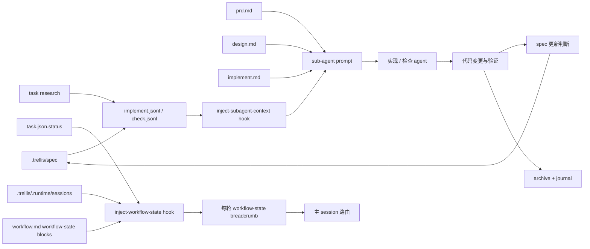

# Nuclio Radical Redesign：Trellis SDD 架构专项分析

> 本报告是已批准 Sequential 研究管线的 Task 2：在 Nuclio 基线之后、Matt Pocock Skills 分析之前，对 `mindfold-ai/trellis` 做独立深读。结论只作为 Task 4 综合比较的事实输入，不是对 Trellis 品牌或 README 叙事的背书。

## 1. 项目定位与版本证据

- **研究对象**：`https://github.com/mindfold-ai/trellis`
- **本地克隆路径**：已在本地研究副本中核查；具体路径不纳入公开文档
- **默认分支**：`origin/main`
- **分析 HEAD**：`51a5674ce6ce5a12cb585c5dcb21e7b76a51bdbc`
- **盘点范围**：CLI 入口、`.trellis/` dogfood 实例、平台 hooks、agent/command prompt、task/workspace scripts、模板源、channel runtime 源码；README 只用作入口索引，下面主张均回查实际文件。

Trellis 的核心定位不是单个 Claude Code skill，而是一个可安装到多平台项目内的 **SDD 工作流层**：`trellis init` 生成 `.trellis/` 持久化目录、平台配置、hooks、agents、commands/skills；后续由 per-turn breadcrumb、task artifacts、jsonl context manifest 和 finish/archive/journal 形成开发闭环。CLI 暴露 `init/update/upgrade/uninstall/mem/workflow/channel` 等命令，实际入口在 `packages/cli/src/cli/index.ts:68-302`（[URL](https://github.com/mindfold-ai/trellis/blob/51a5674ce6ce5a12cb585c5dcb21e7b76a51bdbc/packages/cli/src/cli/index.ts#L68-L302)）。npm 包名和二进制是 `@mindfoldhq/trellis` / `trellis` / `tl`，版本为 `0.6.7`，见 `packages/cli/package.json:2-10`（[URL](https://github.com/mindfold-ai/trellis/blob/51a5674ce6ce5a12cb585c5dcb21e7b76a51bdbc/packages/cli/package.json#L2-L10)）。

## 2. 核心 lifecycle：从请求到归档

Trellis 将开发分为 **Plan → Execute → Finish** 三段，状态主要写在 task `task.json.status` 和 session runtime pointer 中。`.trellis/workflow.md` 明确 Phase Index 为 `Phase 1: Plan`、`Phase 2: Execute`、`Phase 3: Finish`，见 `.trellis/workflow.md:144-150`（[URL](https://github.com/mindfold-ai/trellis/blob/51a5674ce6ce5a12cb585c5dcb21e7b76a51bdbc/.trellis/workflow.md#L144-L150)）。关键用户旅程如下。

```mermaid
flowchart TD
  A[用户请求] --> B{请求分流}
  B -->|小对话或无需任务| Z[跳过 Trellis]
  B -->|复杂或真实变更| C[请求创建任务同意]
  C --> D[task.py create]
  D --> E[prd.md]
  E --> F{复杂任务?}
  F -->|否| G[PRD-only 轻量计划]
  F -->|是| H[design.md + implement.md]
  G --> I[计划审查]
  H --> I
  I --> J[task.py start]
  J --> K[trellis-implement 或 inline edit]
  K --> L[trellis-check]
  L --> M{发现缺陷?}
  M -->|需求缺陷| E
  M -->|实现缺陷| K
  M -->|通过| N[trellis-update-spec]
  N --> O[工作提交]
  O --> P[/trellis:finish-work]
  P --> Q[task.py archive]
  Q --> R[add_session.py]
  R --> S[归档与 journal 完成]
```

### 2.1 请求分流与计划 Gate

无 active task 时，breadcrumb 要求先分类并请求 task-creation consent；复杂任务若用户拒绝创建任务，不应做 broad inline implementation，见 `.trellis/workflow.md:152-156`（[URL](https://github.com/mindfold-ai/trellis/blob/51a5674ce6ce5a12cb585c5dcb21e7b76a51bdbc/.trellis/workflow.md#L152-L156)）和 `no_task` block `.trellis/workflow.md:176-180`（[URL](https://github.com/mindfold-ai/trellis/blob/51a5674ce6ce5a12cb585c5dcb21e7b76a51bdbc/.trellis/workflow.md#L176-L180)）。这是一道软 Gate：AI 必须先取得创建任务同意，但实际 enforcement 依赖 prompt/hook 提醒而非脚本强制。

`task.py create` 写入 `task.json`，初始 `status` 为 `planning`，并创建默认 `prd.md`；复杂任务需要 `design.md` 与 `implement.md`，见 `.trellis/scripts/common/task_store.py:311-344`（[URL](https://github.com/mindfold-ai/trellis/blob/51a5674ce6ce5a12cb585c5dcb21e7b76a51bdbc/.trellis/scripts/common/task_store.py#L311-L344)）。workflow 明确 Planning Artifacts：`prd.md` 承载需求和验收，`design.md` 承载技术设计，`implement.md` 承载执行计划，`implement.jsonl/check.jsonl` 是 sub-agent context manifest 而不是计划替代品，见 `.trellis/workflow.md:158-165`（[URL](https://github.com/mindfold-ai/trellis/blob/51a5674ce6ce5a12cb585c5dcb21e7b76a51bdbc/.trellis/workflow.md#L158-L165)）。

### 2.2 启动实现与状态转换

`task.py start` 是从计划进入实现的关键命令。它把 session 当前任务指向该 task，并在 `task.json.status == planning` 时改为 `in_progress`，见 `.trellis/scripts/task.py:70-137`（[URL](https://github.com/mindfold-ai/trellis/blob/51a5674ce6ce5a12cb585c5dcb21e7b76a51bdbc/.trellis/scripts/task.py#L70-L137)）。workflow 明确 `task.py start` 只能在 artifact review 后执行，且复杂任务必须已有 `prd.md/design.md/implement.md`，sub-agent 平台还需要 curated `implement.jsonl/check.jsonl`，见 `.trellis/workflow.md:436-448`（[URL](https://github.com/mindfold-ai/trellis/blob/51a5674ce6ce5a12cb585c5dcb21e7b76a51bdbc/.trellis/workflow.md#L436-L448)）。这里的 Gate 仍是流程约束而非 task.py 的结构性校验：脚本负责状态写入，是否已审查主要由 AI/用户执行。

### 2.3 实现、检查、spec 更新与提交

进入 `in_progress` 后，主流程要求 `trellis-implement -> trellis-check -> trellis-update-spec -> commit -> /trellis:finish-work`，见 breadcrumb `.trellis/workflow.md:225-230`（[URL](https://github.com/mindfold-ai/trellis/blob/51a5674ce6ce5a12cb585c5dcb21e7b76a51bdbc/.trellis/workflow.md#L225-L230)）。实现步骤在 sub-agent 平台默认 dispatch `trellis-implement`，hook 注入 `implement.jsonl`、`prd.md`、`design.md`、`implement.md`，见 `.trellis/workflow.md:473-486`（[URL](https://github.com/mindfold-ai/trellis/blob/51a5674ce6ce5a12cb585c5dcb21e7b76a51bdbc/.trellis/workflow.md#L473-L486)）。质量检查 dispatch `trellis-check`，负责依据 specs 和 artifacts 审查并自修复，见 `.trellis/workflow.md:527-542`（[URL](https://github.com/mindfold-ai/trellis/blob/51a5674ce6ce5a12cb585c5dcb21e7b76a51bdbc/.trellis/workflow.md#L527-L542)）。最后一次 2.2 被要求 full-scope，而不是只检查最近改动，见 `.trellis/workflow.md:556`（[URL](https://github.com/mindfold-ai/trellis/blob/51a5674ce6ce5a12cb585c5dcb21e7b76a51bdbc/.trellis/workflow.md#L556)）。

Finish 阶段要求 spec update，再进行工作提交。`Phase 3.4 Commit changes` 让 AI 学习最近 commit 风格、分类 dirty files、提出 commit plan 并取得一次确认后执行，不 push、不 amend，见 `.trellis/workflow.md:588-638`（[URL](https://github.com/mindfold-ai/trellis/blob/51a5674ce6ce5a12cb585c5dcb21e7b76a51bdbc/.trellis/workflow.md#L588-L638)）。这说明 Trellis 的 mutation safety 主要靠清晰的 prompt protocol 与 staging discipline，不是像 file-backed Gate 一样由独立审查状态机强制。

### 2.4 完成、归档与 journal

`/trellis:finish-work` 明确不负责代码提交，而是在工作提交之后做归档和 session journal；它先检查 dirty paths，如果仍有当前任务代码变化则要求回到 Phase 3.4，见 `.cursor/commands/trellis-finish-work.md:1-4`（[URL](https://github.com/mindfold-ai/trellis/blob/51a5674ce6ce5a12cb585c5dcb21e7b76a51bdbc/.cursor/commands/trellis-finish-work.md#L1-L4)）和 `.cursor/commands/trellis-finish-work.md:19-44`（[URL](https://github.com/mindfold-ai/trellis/blob/51a5674ce6ce5a12cb585c5dcb21e7b76a51bdbc/.cursor/commands/trellis-finish-work.md#L19-L44)）。随后 `task.py archive <task>` 写 `status=completed`、移动到 `archive/{year-month}/`、清理仍指向该 task 的 session files，并可自动提交 `chore(task): archive ...`，见 `.trellis/scripts/common/task_store.py:500-561`（[URL](https://github.com/mindfold-ai/trellis/blob/51a5674ce6ce5a12cb585c5dcb21e7b76a51bdbc/.trellis/scripts/common/task_store.py#L500-L561)）。`add_session.py` 则写入 workspace journal，并可依据 config 自动提交，workspace index 对 journal、tasks、archive 的结构有说明，见 `.trellis/workspace/index.md:13-22`（[URL](https://github.com/mindfold-ai/trellis/blob/51a5674ce6ce5a12cb585c5dcb21e7b76a51bdbc/.trellis/workspace/index.md#L13-L22)）。

## 3. 上下文选择、注入与刷新

Trellis 的上下文工程分为四层：项目长期 spec、任务计划 artifacts、per-task jsonl manifest、per-turn workflow breadcrumb；另有 research artifact 与 workspace journal 作为可持久化但不会自动全量注入的事实源。



### 3.1 全局项目知识：`.trellis/spec/`

`.trellis/spec/` 被 workflow 描述为按 package/layer 组织的编码指南，index 入口包含 Pre-Development Checklist 和 Quality Check，实际指南由 index 指向的 md 文件承载，见 `.trellis/workflow.md:27-38`（[URL](https://github.com/mindfold-ai/trellis/blob/51a5674ce6ce5a12cb585c5dcb21e7b76a51bdbc/.trellis/workflow.md#L27-L38)）。`trellis init` 会生成 `.trellis/spec/` 的基础模板；`createWorkflowStructure` 负责创建 scripts、workflow、config、workspace、tasks、spec 等目录，见 `packages/cli/src/configurators/workflow.ts:73-152`（[URL](https://github.com/mindfold-ai/trellis/blob/51a5674ce6ce5a12cb585c5dcb21e7b76a51bdbc/packages/cli/src/configurators/workflow.ts#L73-L152)）。这些 spec 是长期事实源；`trellis-update-spec` 在 Finish 阶段判断是否需要把新模式或坑沉淀回 spec，workflow 要求即使结论是“不更新”也要走判断，见 `.trellis/workflow.md:579-586`（[URL](https://github.com/mindfold-ai/trellis/blob/51a5674ce6ce5a12cb585c5dcb21e7b76a51bdbc/.trellis/workflow.md#L579-L586)）。

### 3.2 变更上下文：task directory 与 artifacts

每个任务有独立目录：`task.json`、`prd.md`、可选 `design.md`、可选 `implement.md`、可选 `research/`、以及 sub-agent manifest，见 `.trellis/workflow.md:40-43`（[URL](https://github.com/mindfold-ai/trellis/blob/51a5674ce6ce5a12cb585c5dcb21e7b76a51bdbc/.trellis/workflow.md#L40-L43)）。`task.json` 是执行状态和元数据；`prd/design/implement` 是变更契约；`research/` 是可复用但限定在当前任务的事实材料。

### 3.3 任务上下文 manifest：`implement.jsonl` / `check.jsonl`

Trellis 不把全部 spec/code 自动塞入 sub-agent。`task.py create` 只在检测到 sub-agent-capable 平台时 seed `implement.jsonl` 和 `check.jsonl`，种子行没有 `file` 字段，真正上下文需要 planning 期间由 AI curate，见 `.trellis/scripts/common/task_store.py:347-357`（[URL](https://github.com/mindfold-ai/trellis/blob/51a5674ce6ce5a12cb585c5dcb21e7b76a51bdbc/.trellis/scripts/common/task_store.py#L347-L357)）。`task_context.py` 只接受存在的文件或目录路径，写入 `{"file": "...", "reason": "..."}`，并验证 jsonl 条目的存在性，见 `.trellis/scripts/common/task_context.py:33-80`（[URL](https://github.com/mindfold-ai/trellis/blob/51a5674ce6ce5a12cb585c5dcb21e7b76a51bdbc/.trellis/scripts/common/task_context.py#L33-L80)）和 `.trellis/scripts/common/task_context.py:87-165`（[URL](https://github.com/mindfold-ai/trellis/blob/51a5674ce6ce5a12cb585c5dcb21e7b76a51bdbc/.trellis/scripts/common/task_context.py#L87-L165)）。workflow 明确禁止把 code files 或即将修改的文件放进 manifest，因为代码由 sub-agent 实时读取，manifest 只列 spec/research，见 `.trellis/workflow.md:391-403`（[URL](https://github.com/mindfold-ai/trellis/blob/51a5674ce6ce5a12cb585c5dcb21e7b76a51bdbc/.trellis/workflow.md#L391-L403)）。

### 3.4 即时注入：hooks 与 fallback 读取

`.claude/settings.json` 显示 SessionStart、PreToolUse(Task/Agent)、UserPromptSubmit 三类 hook：SessionStart 注入总体上下文，PreToolUse 调 `inject-subagent-context.py`，UserPromptSubmit 调 `inject-workflow-state.py`，见 `.claude/settings.json:5-71`（[URL](https://github.com/mindfold-ai/trellis/blob/51a5674ce6ce5a12cb585c5dcb21e7b76a51bdbc/.claude/settings.json#L5-L71)）。

`inject-subagent-context.py` 对 implement agent 的读取顺序是 `implement.jsonl` → `prd.md` → `design.md` → `implement.md`，见 `.claude/hooks/inject-subagent-context.py:275-311`（[URL](https://github.com/mindfold-ai/trellis/blob/51a5674ce6ce5a12cb585c5dcb21e7b76a51bdbc/.claude/hooks/inject-subagent-context.py#L275-L311)）；check agent 类似读取 `check.jsonl` 和 task artifacts，见 `.claude/hooks/inject-subagent-context.py:314-339`（[URL](https://github.com/mindfold-ai/trellis/blob/51a5674ce6ce5a12cb585c5dcb21e7b76a51bdbc/.claude/hooks/inject-subagent-context.py#L314-L339)）。若 jsonl 只有 seed 或为空，hook 会警告但仍只注入 task artifacts，见 `.claude/hooks/inject-subagent-context.py:190-256`（[URL](https://github.com/mindfold-ai/trellis/blob/51a5674ce6ce5a12cb585c5dcb21e7b76a51bdbc/.claude/hooks/inject-subagent-context.py#L190-L256)）。agent prompt 还要求若 hook marker 缺失，则从 dispatch prompt 的 `Active task: <path>` 自行读取 jsonl 和 artifacts，见 `.claude/agents/trellis-implement.md:19-25`（[URL](https://github.com/mindfold-ai/trellis/blob/51a5674ce6ce5a12cb585c5dcb21e7b76a51bdbc/.claude/agents/trellis-implement.md#L19-L25)）与 `.claude/agents/trellis-check.md:19-25`（[URL](https://github.com/mindfold-ai/trellis/blob/51a5674ce6ce5a12cb585c5dcb21e7b76a51bdbc/.claude/agents/trellis-check.md#L19-L25)）。

`inject-workflow-state.py` 每轮解析 `.trellis/workflow.md` 中的 `[workflow-state:STATUS]` blocks；文件注释明确 workflow.md 是 breadcrumb 单一事实源，脚本没有内置 fallback dict，见 `.claude/hooks/inject-workflow-state.py:13-18`（[URL](https://github.com/mindfold-ai/trellis/blob/51a5674ce6ce5a12cb585c5dcb21e7b76a51bdbc/.claude/hooks/inject-workflow-state.py#L13-L18)）和 `.claude/hooks/inject-workflow-state.py:174-197`（[URL](https://github.com/mindfold-ai/trellis/blob/51a5674ce6ce5a12cb585c5dcb21e7b76a51bdbc/.claude/hooks/inject-workflow-state.py#L174-L197)）。这使 workflow prompt 本身可定制，但也意味着强制性依赖 prompt 文本的完整性。

### 3.5 禁止/隐式上下文

Trellis 明确避免把代码文件、待修改文件放入 manifest，见 `.trellis/workflow.md:395-398`（[URL](https://github.com/mindfold-ai/trellis/blob/51a5674ce6ce5a12cb585c5dcb21e7b76a51bdbc/.trellis/workflow.md#L395-L398)）。它也不将 chat transcript 作为唯一记忆：research agent 要求所有研究输出写入 `{TASK_DIR}/research/`，不能只回 chat，见 `.claude/agents/trellis-research.md:11-16`（[URL](https://github.com/mindfold-ai/trellis/blob/51a5674ce6ce5a12cb585c5dcb21e7b76a51bdbc/.claude/agents/trellis-research.md#L11-L16)）。同时 active task 指针是 session-scoped；若无法解析 session identity，`task.py start` 会 degraded：仍将 status 改为 `in_progress`，但不持久化 session pointer，见 `.trellis/scripts/task.py:95-119`（[URL](https://github.com/mindfold-ai/trellis/blob/51a5674ce6ce5a12cb585c5dcb21e7b76a51bdbc/.trellis/scripts/task.py#L95-L119)）。

## 4. 开发中间产物账本

| 分类 | 产物 | 谁写 | 谁读 | 生命周期 | 失败恢复价值 | 证据 |
|---|---|---|---|---|---|---|
| 长期事实源 | `.trellis/spec/**` | `trellis init` 初始化，Finish 阶段 `trellis-update-spec` 更新 | main session、implement/check agents、`get_context.py --mode packages` | 长期保留，随项目演化 | 压缩后仍保留团队约定，减少重复踩坑 | `.trellis/workflow.md:27-38`（[URL](https://github.com/mindfold-ai/trellis/blob/51a5674ce6ce5a12cb585c5dcb21e7b76a51bdbc/.trellis/workflow.md#L27-L38)） |
| 工作流契约 | `.trellis/workflow.md` | Trellis 模板；本地可改 | hooks、AI、`get_context.py --mode phase` | 长期保留，可 `trellis update/workflow` 更新 | breadcrumb 单一事实源，帮助断点恢复到正确 phase | `.trellis/workflow.md:99-142`（[URL](https://github.com/mindfold-ai/trellis/blob/51a5674ce6ce5a12cb585c5dcb21e7b76a51bdbc/.trellis/workflow.md#L99-L142)） |
| 执行状态 | `.trellis/tasks/<task>/task.json` | `task.py create/start/archive/set-*` | hooks、`task.py current/list`、finish flow | active 期间保留，archive 后移动 | 明确 status、assignee、branch、parent/children，支持继续和归档 | `.trellis/scripts/common/task_store.py:311-336`（[URL](https://github.com/mindfold-ai/trellis/blob/51a5674ce6ce5a12cb585c5dcb21e7b76a51bdbc/.trellis/scripts/common/task_store.py#L311-L336)） |
| 需求契约 | `prd.md` | `task.py create` skeleton，AI planning 更新 | main/implement/check/finish | 随 task 归档 | 压缩后仍保留需求和验收，支持 rollback 到计划 | `.trellis/workflow.md:158-165`（[URL](https://github.com/mindfold-ai/trellis/blob/51a5674ce6ce5a12cb585c5dcb21e7b76a51bdbc/.trellis/workflow.md#L158-L165)） |
| 技术契约 | `design.md` | AI planning 对复杂任务创建 | implement/check/main | 可选，随 task 归档 | 约束边界、数据流、兼容/回滚，避免实现漂移 | `.trellis/workflow.md:160-164`（[URL](https://github.com/mindfold-ai/trellis/blob/51a5674ce6ce5a12cb585c5dcb21e7b76a51bdbc/.trellis/workflow.md#L160-L164)） |
| 执行计划 | `implement.md` | AI planning 对复杂任务创建 | implement/check/main | 可选，随 task 归档 | 记录顺序、验证命令、review gate、rollback point | `.trellis/workflow.md:162-164`（[URL](https://github.com/mindfold-ai/trellis/blob/51a5674ce6ce5a12cb585c5dcb21e7b76a51bdbc/.trellis/workflow.md#L162-L164)） |
| 上下文 manifest | `implement.jsonl` / `check.jsonl` | `task.py create` seed；AI planning curate；`task.py add-context` append | PreToolUse hook、agent fallback、`task.py validate` | 随 task 归档 | 防止 sub-agent 依赖父会话记忆；可验证文件是否仍存在 | `.trellis/scripts/common/task_context.py:33-80`（[URL](https://github.com/mindfold-ai/trellis/blob/51a5674ce6ce5a12cb585c5dcb21e7b76a51bdbc/.trellis/scripts/common/task_context.py#L33-L80)） |
| 研究事实 | `{TASK_DIR}/research/*.md` | `trellis-research` 或 inline research | planning、implement/check、future readers | 随 task 归档 | 将外部/内部调查从 chat 中沉淀，支持复查 | `.claude/agents/trellis-research.md:48-60`（[URL](https://github.com/mindfold-ai/trellis/blob/51a5674ce6ce5a12cb585c5dcb21e7b76a51bdbc/.claude/agents/trellis-research.md#L48-L60)） |
| 临时运行态 | `.trellis/.runtime/sessions/*.json` | active task resolver / hooks / `task.py start` | hooks、`task.py current` | session-scoped，gitignored，finish/archive 清理 | 将 active task 绑定到 AI session，避免多窗口串线 | `.trellis/scripts/common/active_task.py:484-510`（[URL](https://github.com/mindfold-ai/trellis/blob/51a5674ce6ce5a12cb585c5dcb21e7b76a51bdbc/.trellis/scripts/common/active_task.py#L484-L510)） |
| 验证证据 | lint/typecheck/test 输出、check agent 报告 | implement/check/main | main/user | 通常在 chat 或提交前上下文，不一定文件化 | 短期确认质量；但可追溯性弱于文件报告 | `.claude/agents/trellis-check.md:80-115`（[URL](https://github.com/mindfold-ai/trellis/blob/51a5674ce6ce5a12cb585c5dcb21e7b76a51bdbc/.claude/agents/trellis-check.md#L80-L115)） |
| 长期工作记录 | `.trellis/workspace/<developer>/journal-*.md` | `add_session.py` | `get_context.py --mode record`、人类/AI | 长期，按 2000 行轮转 | 跨 session 恢复工作历史和 commits | `.trellis/workspace/index.md:66-80`（[URL](https://github.com/mindfold-ai/trellis/blob/51a5674ce6ce5a12cb585c5dcb21e7b76a51bdbc/.trellis/workspace/index.md#L66-L80)） |
| 归档事实 | `.trellis/tasks/archive/<YYYY-MM>/<task>/` | `task.py archive` | future review、finish/history | 完成后长期保留 | 保留完整任务契约与上下文，便于审计 | `.trellis/scripts/common/task_store.py:535-560`（[URL](https://github.com/mindfold-ai/trellis/blob/51a5674ce6ce5a12cb585c5dcb21e7b76a51bdbc/.trellis/scripts/common/task_store.py#L535-L560)） |

## 5. SDD 控制逻辑、agent/controller 责任与确定性边界

### 5.1 Controller 是主 session + workflow breadcrumb

Trellis 没有独立 daemon 或中央 Gate 服务。主 session 根据 UserPromptSubmit 注入的 `<workflow-state>`、`/trellis:continue`、`.trellis/workflow.md` 和 task artifacts 进行路由。`/trellis:continue` 先运行 `get_context.py`，再加载 Phase Index，最后依据 `status` 和 artifact presence 选择下一步，见 `.cursor/commands/trellis-continue.md:7-50`（[URL](https://github.com/mindfold-ai/trellis/blob/51a5674ce6ce5a12cb585c5dcb21e7b76a51bdbc/.cursor/commands/trellis-continue.md#L7-L50)）。因此 Controller 的“确定性”来自脚本提供的状态读取和 prompt 明确性，而非 workflow engine。

### 5.2 Worker agent 只做局部角色，但权限宽松

`trellis-implement` 的职责是读 specs 和 artifacts、实现、运行 lint/typecheck，不得 commit/push/merge，工具包括 Read/Write/Edit/Bash/Glob/Grep，见 `.claude/agents/trellis-implement.md:1-6`（[URL](https://github.com/mindfold-ai/trellis/blob/51a5674ce6ce5a12cb585c5dcb21e7b76a51bdbc/.claude/agents/trellis-implement.md#L1-L6)）和 `.claude/agents/trellis-implement.md:43-50`（[URL](https://github.com/mindfold-ai/trellis/blob/51a5674ce6ce5a12cb585c5dcb21e7b76a51bdbc/.claude/agents/trellis-implement.md#L43-L50)）。`trellis-check` 不只是 reviewer，它有写权限并被要求 self-fix，见 `.claude/agents/trellis-check.md:35-47`（[URL](https://github.com/mindfold-ai/trellis/blob/51a5674ce6ce5a12cb585c5dcb21e7b76a51bdbc/.claude/agents/trellis-check.md#L35-L47)）。`trellis-research` 只允许写 `{TASK_DIR}/research/*.md`，禁止 code/spec/platform config/git 操作，见 `.claude/agents/trellis-research.md:63-79`（[URL](https://github.com/mindfold-ai/trellis/blob/51a5674ce6ce5a12cb585c5dcb21e7b76a51bdbc/.claude/agents/trellis-research.md#L63-L79)）。

这体现一个重要取舍：Trellis 的 check agent 是“修复型检查者”，提高吞吐，但弱化了独立 reviewer Gate。Nuclio 若需要强审查边界，不能直接照搬 check self-fix 模式。

### 5.3 确定性脚本边界

确定性脚本负责：创建/启动/归档 task、读写 active session pointer、解析 workflow steps、校验 jsonl、追加 session journal、安装/更新模板。比如 active task resolver 在 `.trellis/.runtime/sessions/` 按 session key 解析当前 task，并且当无法定位唯一 session 时拒绝跨窗口猜测，见 `.trellis/scripts/common/active_task.py:484-535`（[URL](https://github.com/mindfold-ai/trellis/blob/51a5674ce6ce5a12cb585c5dcb21e7b76a51bdbc/.trellis/scripts/common/active_task.py#L484-L535)）。archive 自动提交只 stage Trellis-owned task paths，并在 `.gitignore` 阻止时警告而不强制 `git add -f`，见 `.trellis/scripts/common/task_store.py:566-648`（[URL](https://github.com/mindfold-ai/trellis/blob/51a5674ce6ce5a12cb585c5dcb21e7b76a51bdbc/.trellis/scripts/common/task_store.py#L566-L648)）。

### 5.4 审批点和恢复机制

Trellis 的审批点主要有三类：

1. **创建任务同意**：无 active task 时先询问，见 `.trellis/workflow.md:152-156`（[URL](https://github.com/mindfold-ai/trellis/blob/51a5674ce6ce5a12cb585c5dcb21e7b76a51bdbc/.trellis/workflow.md#L152-L156)）。
2. **进入实现审查**：`task.py start` 前要求 artifact review 和用户确认，见 `.trellis/workflow.md:436-448`（[URL](https://github.com/mindfold-ai/trellis/blob/51a5674ce6ce5a12cb585c5dcb21e7b76a51bdbc/.trellis/workflow.md#L436-L448)）。
3. **提交确认**：Phase 3.4 提交计划要一次性呈现并取得确认，见 `.trellis/workflow.md:594-630`（[URL](https://github.com/mindfold-ai/trellis/blob/51a5674ce6ce5a12cb585c5dcb21e7b76a51bdbc/.trellis/workflow.md#L594-L630)）。

恢复机制包括：discoveries 可从 Execute 回 Plan；check 发现 PRD defect 回 Phase 1，implementation 失败则 revert code 后 redo，缺 research 则写入 `research/`，见 `.trellis/workflow.md:263-269`（[URL](https://github.com/mindfold-ai/trellis/blob/51a5674ce6ce5a12cb585c5dcb21e7b76a51bdbc/.trellis/workflow.md#L263-L269)）和 `.trellis/workflow.md:558-563`（[URL](https://github.com/mindfold-ai/trellis/blob/51a5674ce6ce5a12cb585c5dcb21e7b76a51bdbc/.trellis/workflow.md#L558-L563)）。

### 5.5 可选 channel runtime

除传统 task/agent 流外，Trellis CLI 还注册了 `channel` 命令：它提供 create/send/wait/interrupt/spawn/run/rm/prune/list 等共享事件日志协作能力，见 `packages/cli/src/commands/channel/index.ts:42-47`（[URL](https://github.com/mindfold-ai/trellis/blob/51a5674ce6ce5a12cb585c5dcb21e7b76a51bdbc/packages/cli/src/commands/channel/index.ts#L42-L47)）和 `packages/cli/src/commands/channel/index.ts:274-382`（[URL](https://github.com/mindfold-ai/trellis/blob/51a5674ce6ce5a12cb585c5dcb21e7b76a51bdbc/packages/cli/src/commands/channel/index.ts#L274-L382)）。`createWorkflowStructure` 始终写入 `.trellis/agents/` runtime agent definitions，以便用户随时切换 channel-driven workflow，见 `packages/cli/src/configurators/workflow.ts:122-131`（[URL](https://github.com/mindfold-ai/trellis/blob/51a5674ce6ce5a12cb585c5dcb21e7b76a51bdbc/packages/cli/src/configurators/workflow.ts#L122-L131)）。但从 native workflow 看，channel 是扩展 runtime，不是默认 Plan/Execute/Finish 的必要路径。

## 6. Trellis 简洁性来自哪里

Trellis 的简洁性并非只来自更少文件，而来自三种取舍：

1. **能力取舍**：它没有强制 reviewer Gate、review-state ledger 或 immutable handoff；check agent 可自修复，降低编排复杂度但牺牲独立审查证明。
2. **默认约定**：以 `.trellis/workflow.md` 为单一 prompt 源，以 `task.py` 为状态写入者，以 `implement.jsonl/check.jsonl` 为 curated context manifest；这些约定清晰但很多约束靠 AI 遵守。
3. **更好的抽象**：workflow-state blocks 让每轮 breadcrumb 从可编辑 workflow 文档解析，而不是把状态提示散落在脚本里；session-scoped active task 避免多窗口混线；context manifest 将“要预注入的 spec/research”从“要修改/读取的代码”中分离。

## 7. 优点、代价与风险

### 7.1 优点

- **持久化优先**：planning、research、spec、journal、archive 都落盘，符合“conversations get compacted; files don't”的原则，见 `.trellis/workflow.md:7-12`（[URL](https://github.com/mindfold-ai/trellis/blob/51a5674ce6ce5a12cb585c5dcb21e7b76a51bdbc/.trellis/workflow.md#L7-L12)）。
- **上下文显式选择**：jsonl manifest 要求 reason，禁止把 code paths 预注册，降低无边界上下文膨胀。
- **跨平台模板化**：CLI 能按平台写 hooks、agents、commands/skills，统一核心目录和脚本。
- **session 隔离**：active task 按 session key 存储，缺失时最多单 session fallback，不在多窗口间猜测。
- **workflow 可定制**：breadcrumb 来自 workflow.md tag block，定制流程不必改 hook 代码。
- **finish 与 journal 拆分**：工作提交、任务归档、journal 记录的提交顺序被明确区分，降低 bookkeeping 混入产品提交的风险。

### 7.2 代价与风险

- **Gate 偏软**：artifact review、start approval、commit plan confirmation 大多由 prompt 约束；脚本不强制检查 `design.md/implement.md/jsonl` 是否满足复杂任务要求。
- **check agent 兼具写权限**：self-fix 模式提高效率，但不适合需要不可变 reviewer 证据和职责分离的流程。
- **验证证据不天然文件化**：lint/typecheck/test 输出通常在 chat/report 中，不像 task artifacts 一样有统一 evidence ledger。
- **hook 可用性影响体验**：Windows、resume、fork distribution、hooks disabled 等场景需要 fallback 读取；若 fallback prompt 没写好，context injection 可能降级。
- **workflow 文本成为运行契约**：这提升定制性，也意味着修改 workflow.md 可能破坏 required step 与 breadcrumb 同步；Trellis 用注释和测试约束提醒，但用户项目本地改动仍可能漂移。
- **archive 自动 git commit 对 Nuclio 未必可接受**：Trellis 对 `.trellis/tasks` bookkeeping 自动提交，而 Nuclio 当前可能需要严格 Controller 管理状态和候选提交边界。

## 8. Nuclio 借鉴分类

### 8.1 可直接借鉴

| 设计 | 原因 | Nuclio 启示 |
|---|---|---|
| Workflow 文档中的状态 breadcrumb block | Hook 只解析 workflow.md，不内置提示字典，流程可由文档统一维护 | Nuclio 可把 lifecycle routing prompt 收敛为单一可审查状态段，减少 skill/agent/reference 重复 |
| `prd/design/implement` 分层 | Trellis 清楚区分需求、技术设计、执行计划，避免 PRD 混杂 checklist | Nuclio radical redesign 可保留/强化 brief/design/plan 的职责边界 |
| `implement.jsonl/check.jsonl` 显式 context manifest | spec/research 由 AI curate，code 不预注册 | Nuclio 可采用 “manifest 只列 bounded context 和事实源，不列待改文件” 的更轻上下文注入 |
| session-scoped active task | 防止多窗口共享单一 current-task 指针 | Nuclio 若保留多任务/多 worker，可借鉴 session key + refuse-to-guess fallback |
| research 必须落盘 | research agent 禁止只回 chat | Nuclio 的 brief/design/implement 可要求外部研究进入 task-local evidence 文件或 report section |
| finish 前 dirty path 分类 | `/finish-work` 不提交代码，只阻止未提交当前任务变更进入归档 | Nuclio verify/fold 可直接吸收 “current-task dirty vs unrelated dirty” 分类提示 |

### 8.2 需改造借鉴

| 设计 | 需改造原因 | Nuclio 可能形态 |
|---|---|---|
| check agent self-fix | Nuclio 需要独立审查 Gate 和 mutation safety，不能让 reviewer 默认改产品代码 | 拆成 fixer 与 reviewer；reviewer 只读，fixer 在明确 handoff 后改 |
| soft approval gates | Trellis 多数 Gate 靠 prompt；Nuclio 需要文件化审查状态和 approval-gated verify/fold | 将 artifact review/start/finish 写入 deterministic helper 的状态转移，而不是只写在 prompt |
| archive/journal auto-commit | Nuclio 状态和产品提交边界更严格，不能让 helper 随意产生 bookkeeping commit | 可保留 archive/journal 文件化，但提交由 Controller 显式确认和隔离 |
| workflow.md 单一事实源 | 文档可定制但易漂移；Nuclio 的 protocol/rubric 可能需要 schema 校验 | workflow 文档 + machine-readable lifecycle schema 双轨，静态验证两者同步 |
| per-platform hooks 模板 | Nuclio 当前是 marketplace plugin，不一定安装项目本地 `.claude/` hooks | 可把 hook 思路转为 plugin skill 内部 context contract，或只对 opt-in local install 使用 |
| channel runtime | 多 agent event log 有价值，但复杂度高且不属于 Nuclio MVP 必要路径 | 只借鉴 append-only message/event log 概念，不直接引入长期 worker supervisor |

### 8.3 不适用于 Nuclio

| 设计 | 不适用原因 |
|---|---|
| 默认 check agent 可写可修 | 与 Nuclio 的 bounded reviewer / final-reviewer 只读边界冲突 |
| 依赖项目本地 `.trellis/` 安装作为主运行态 | Nuclio 当前源真相在 marketplace plugin 与 `.dev-docs` protocol，不能要求每个项目 vendor 一套 Trellis runtime |
| 将复杂任务 ready gate 完全交给 AI 判断 | Nuclio 的重构目标不能牺牲 explicit intent boundary 和 review-state/Gate 可审计性 |
| finish 阶段自动 archive commit 和 journal commit | Nuclio 的 state/Gate artifacts 和产品提交需要 Controller 严格分离；自动 bookkeeping commit 会增加审计难度 |
| 以多平台广覆盖为核心复杂度 | Nuclio 优先应优化本仓库 plugin lifecycle 和 bounded agents，而不是复制 Trellis 的平台矩阵 |

## 9. 对 Nuclio radical redesign 的关键启示

1. **保留事实源，但减少“状态散落”**：Trellis 的 workflow-state block 证明，prompt 路由可以集中到一个可解析文档片段；Nuclio 可将 lifecycle 文案、required steps、状态提示统一为一个文档/模板，并由 helper 做静态一致性检查。
2. **把上下文选择变成产物**：与其让 worker 自由读全仓，不如在 planning 阶段写 context manifest，列出 spec/research/known constraints；待改代码仍由 worker 按任务读取。这样可以减少 prompt 重量并保留 bounded context。
3. **强化 Trellis 软 Gate 的硬化版本**：Trellis 的 Plan→Start→Execute→Check→Spec→Commit→Finish 顺序合理，但 Nuclio 应将 artifact review、reviewer result、change-wide completion、fold approval 写成机器可验证状态，而不是只靠 breadcrumb。
4. **职责分离要比 Trellis 更严格**：Trellis 的 check self-fix 是吞吐优化；Nuclio 若追求 mutation safety，应保留 implementer/fixer 可写、reviewer/final-reviewer 只读的边界。
5. **journal/archive 可作为长期知识沉淀灵感**：Nuclio fold 可以借鉴 Trellis 的 session journal 和 task archive，但应避免自动 git commit；知识沉淀必须 approval-first。
6. **可定制 workflow 不等于可任意漂移**：Trellis 把 workflow.md 作为可编辑事实源很有启发，但 Nuclio 应配套 schema/static probes，避免 required step 与 hook/agent prompt 脱节。
7. **“简洁”不可通过删除安全属性获得**：Trellis 的简洁部分来自放弃强 Gate 和独立 review ledger；Nuclio 不能照搬这部分，否则会违反持久化事实源、显式意图边界、bounded context、change-wide completion、可审查知识沉淀和 mutation safety。

## 10. 验证说明

- 已对关键主张回查本地克隆仓库文件，并使用记录的 SHA 构造 GitHub permalink。
- Mermaid fence 共 2 组，均为 ` ```mermaid ` 与 ` ``` ` 成对。
- 本报告没有把 README 叙述当作已验证实现；主要证据来自 `.trellis/` dogfood 文件、CLI source、hook scripts、agent/command templates。
- 外部源码仅存在于本地研究副本，未写入当前仓库。
